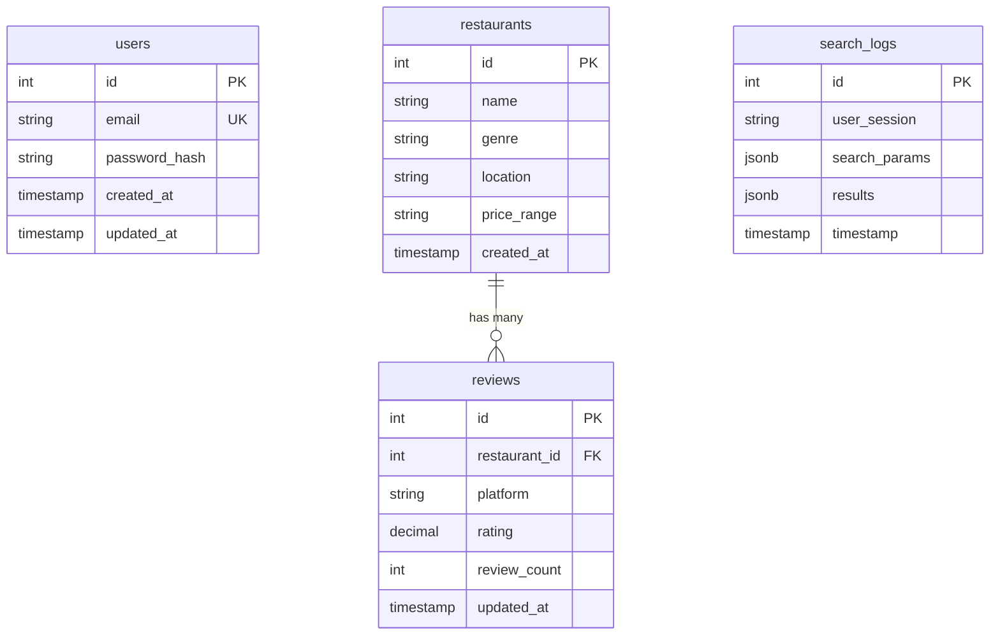

# データベース設計書

## ER図 (Mermaid形式)

## テーブル詳細

### users テーブル
| カラム名 | データ型 | 制約 | 説明 |
|---------|---------|------|------|
| id | SERIAL | PRIMARY KEY | ユーザーID |
| email | VARCHAR(255) | UNIQUE NOT NULL | メールアドレス |
| password_hash | VARCHAR(255) | NOT NULL | ハッシュ化されたパスワード |
| created_at | TIMESTAMP WITH TIME ZONE | DEFAULT NOW() | 作成日時 |
| updated_at | TIMESTAMP WITH TIME ZONE | DEFAULT NOW() | 更新日時 |

### restaurants テーブル
| カラム名 | データ型 | 制約 | 説明 |
|---------|---------|------|------|
| id | SERIAL | PRIMARY KEY | レストランID |
| name | VARCHAR(255) | NOT NULL | レストラン名 |
| genre | VARCHAR(100) | NOT NULL | ジャンル |
| location | VARCHAR(255) | NOT NULL | 所在地 |
| price_range | VARCHAR(50) | NOT NULL | 価格帯 (low/medium/high) |
| created_at | TIMESTAMP WITH TIME ZONE | DEFAULT NOW() | 作成日時 |

### reviews テーブル
| カラム名 | データ型 | 制約 | 説明 |
|---------|---------|------|------|
| id | SERIAL | PRIMARY KEY | レビューID |
| restaurant_id | INTEGER | FOREIGN KEY NOT NULL | レストランID |
| platform | VARCHAR(50) | NOT NULL | プラットフォーム名 |
| rating | DECIMAL(3,2) | NOT NULL CHECK (rating >= 0 AND rating <= 5) | 評価 (0-5) |
| review_count | INTEGER | NOT NULL DEFAULT 0 CHECK (review_count >= 0) | レビュー数 |
| updated_at | TIMESTAMP WITH TIME ZONE | DEFAULT NOW() | 更新日時 |

### search_logs テーブル
| カラム名 | データ型 | 制約 | 説明 |
|---------|---------|------|------|
| id | SERIAL | PRIMARY KEY | ログID |
| user_session | VARCHAR(255) | NOT NULL | ユーザーセッション |
| search_params | JSONB | NOT NULL | 検索パラメータ |
| results | JSONB | NOT NULL | 検索結果 |
| timestamp | TIMESTAMP WITH TIME ZONE | DEFAULT NOW() | 検索実行日時 |

## インデックス

- `idx_restaurants_genre` ON restaurants(genre)
- `idx_restaurants_location` ON restaurants(location)
- `idx_restaurants_price_range` ON restaurants(price_range)
- `idx_reviews_restaurant_id` ON reviews(restaurant_id)
- `idx_reviews_platform` ON reviews(platform)
- `idx_search_logs_user_session` ON search_logs(user_session)
- `idx_search_logs_timestamp` ON search_logs(timestamp)
- `idx_users_email` ON users(email)