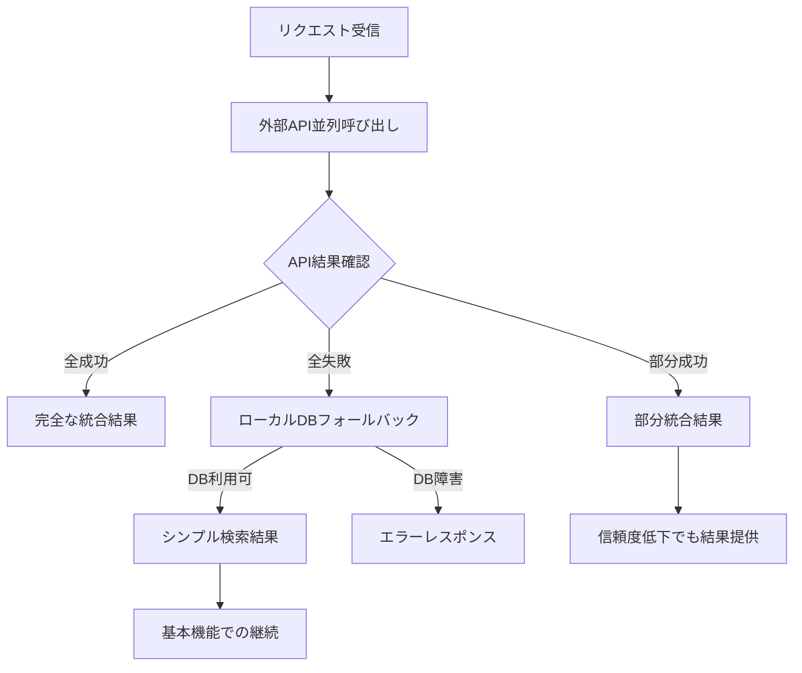

# エラーハンドリング・フォールバック戦略 詳細仕様書

## 概要

本文書では、外部API統合システムにおけるエラーハンドリングとフォールバック戦略について詳細に説明します。システムの高可用性を確保し、部分的な障害が発生してもサービスを継続提供するためのアーキテクチャを定義します。

## 設計原則

### 1. グレースフルデグラデーション (Graceful Degradation)

**原則**: 一部の機能が失敗しても、可能な限りサービスを継続提供



### 2. 障害分離 (Fault Isolation)

**原則**: 一つのAPIの障害が他のAPIに影響しないよう分離

### 3. 段階的フォールバック (Tiered Fallback)

**原則**: 複数レベルのフォールバック機能を準備

## 障害パターンと対応戦略

### 1. 単一API障害

#### 障害パターン
- 特定のAPIのみレスポンス遅延・エラー
- ネットワーク問題による一時的接続不可
- API側のメンテナンス・障害

#### 対応戦略

```typescript
class ApiIntegrationService {
  async fetchFromAllAPIs(params): Promise<APIResult> {
    const apiCalls = [
      this.safeApiCall('tabelog', () => this.fetchFromTabelog(params)),
      this.safeApiCall('hotpepper', () => this.fetchFromHotpepper(params)),
      this.safeApiCall('googlePlaces', () => this.fetchFromGooglePlaces(params)),
      this.safeApiCall('retty', () => this.fetchFromRetty(params)),
    ];

    const results = await Promise.allSettled(apiCalls);
    
    const successfulResults = results
      .filter((result, index) => {
        if (result.status === 'fulfilled') {
          return true;
        } else {
          console.warn(`API ${this.platformNames[index]} failed:`, result.reason);
          return false;
        }
      })
      .map(result => (result as PromiseFulfilledResult<any>).value);

    return this.processPartialResults(successfulResults);
  }

  private async safeApiCall<T>(
    platformName: string,
    apiCall: () => Promise<T>
  ): Promise<T> {
    try {
      const result = await Promise.race([
        apiCall(),
        this.createTimeoutPromise(10000) // 10秒タイムアウト
      ]);
      
      this.recordSuccess(platformName);
      return result;
    } catch (error) {
      this.recordFailure(platformName, error);
      throw error;
    }
  }
}
```

#### 影響と対応

| 失敗API | 影響 | 対応 |
|---------|------|------|
| 1つ | 軽微 | 残り3つで評価継続、信頼度0.75 |
| 2つ | 中程度 | 残り2つで評価継続、信頼度0.5 |
| 3つ | 重大 | 残り1つで評価継続、信頼度0.25 |

### 2. 複数API障害

#### 障害パターン
- 大規模ネットワーク障害
- 複数サービスの同時障害
- 共通インフラの問題

#### 段階的フォールバック

```typescript
class FallbackManager {
  async handleMultipleApiFailures(
    successfulResults: APIResult[],
    params: SearchParams
  ): Promise<SearchResult> {
    
    if (successfulResults.length >= 2) {
      // 2つ以上成功: 部分統合結果を返却
      return this.createPartialIntegratedResult(successfulResults, params);
    }
    
    if (successfulResults.length === 1) {
      // 1つのみ成功: 単一ソース結果を返却
      return this.createSingleSourceResult(successfulResults[0], params);
    }
    
    // 全API失敗: ローカルDBにフォールバック
    console.warn('All external APIs failed, falling back to local database');
    return this.fallbackToLocalDatabase(params);
  }

  private async fallbackToLocalDatabase(params: SearchParams): Promise<SearchResult> {
    try {
      const localResults = await this.restaurantService.searchRestaurants(params);
      
      return {
        restaurants: localResults.map(r => this.convertToEvaluationResult(r)),
        totalAvailable: localResults.length,
        platformsUsed: ['local'],
        searchTime: 0,
        cached: false,
        fallbackReason: 'external_apis_unavailable',
        confidence: 0.3, // ローカルデータのみなので低信頼度
      };
    } catch (dbError) {
      console.error('Local database fallback failed:', dbError);
      throw createError('All data sources unavailable', 503);
    }
  }
}
```

### 3. キャッシュ障害対応

#### Redis障害時のフォールバック

```typescript
class CacheService {
  async get<T>(key: string, options?: CacheOptions): Promise<T | null> {
    // Primary: Redis キャッシュ
    if (this.connected) {
      try {
        return await this.getFromRedis<T>(key, options);
      } catch (error) {
        console.warn('Redis cache failed, falling back to memory cache:', error);
        this.connected = false;
      }
    }

    // Fallback: メモリキャッシュ
    return await this.getFromMemory<T>(key);
  }

  async set<T>(key: string, value: T, ttlSeconds?: number): Promise<void> {
    // Primary: Redis への保存試行
    if (this.connected) {
      try {
        await this.setInRedis(key, value, ttlSeconds);
        // Redis成功時もメモリにバックアップ保存
        await this.setInMemory(key, value, ttlSeconds);
        return;
      } catch (error) {
        console.warn('Redis cache write failed, using memory only:', error);
        this.connected = false;
      }
    }

    // Fallback: メモリキャッシュのみ
    await this.setInMemory(key, value, ttlSeconds);
  }
}
```

### 4. データベース障害対応

#### 最終フォールバック戦略

```typescript
class DatabaseFallbackStrategy {
  async handleDatabaseFailure(params: SearchParams): Promise<SearchResult> {
    // 1. 期限切れキャッシュを含む全キャッシュから検索
    const staleResults = await this.searchInStaleCache(params);
    if (staleResults) {
      console.warn('Using stale cache data due to database failure');
      return {
        ...staleResults,
        cached: true,
        stale: true,
        fallbackReason: 'database_unavailable',
      };
    }

    // 2. 静的データによる最小限レスポンス
    return this.createMinimalResponse(params);
  }

  private createMinimalResponse(params: SearchParams): SearchResult {
    return {
      restaurants: [],
      totalAvailable: 0,
      platformsUsed: [],
      searchTime: 0,
      cached: false,
      error: {
        message: 'サービスが一時的に利用できません。しばらく後に再試行してください。',
        code: 'SERVICE_TEMPORARILY_UNAVAILABLE',
        retryAfter: 300, // 5分後に再試行推奨
      }
    };
  }
}
```

## レート制限・タイムアウト処理

### 1. レート制限対応

#### 指数バックオフ

```typescript
class RateLimitHandler {
  private backoffMultiplier = 2;
  private maxBackoffTime = 60000; // 60秒

  async handleRateLimit(platform: string, attempt: number): Promise<void> {
    const baseDelay = 1000; // 1秒
    const delay = Math.min(
      baseDelay * Math.pow(this.backoffMultiplier, attempt),
      this.maxBackoffTime
    );

    console.log(`Rate limit hit for ${platform}, waiting ${delay}ms (attempt ${attempt})`);
    
    await this.sleep(delay);
    
    // ジッターを追加してサンダリングハード問題を回避
    const jitter = Math.random() * 0.1 * delay;
    await this.sleep(jitter);
  }

  private sleep(ms: number): Promise<void> {
    return new Promise(resolve => setTimeout(resolve, ms));
  }
}
```

#### レート制限監視

```typescript
class RateLimitMonitor {
  private rateLimitStatus = new Map<string, RateLimitInfo>();

  updateRateLimit(platform: string, headers: Record<string, string>): void {
    const remaining = parseInt(headers['x-ratelimit-remaining'] || '0');
    const reset = parseInt(headers['x-ratelimit-reset'] || '0');
    
    this.rateLimitStatus.set(platform, {
      remaining,
      reset: new Date(reset * 1000),
      platform,
    });

    // 残り10%以下になったら警告
    if (remaining < this.getLimit(platform) * 0.1) {
      console.warn(`Rate limit warning for ${platform}: ${remaining} requests remaining`);
    }
  }

  shouldThrottleRequests(platform: string): boolean {
    const status = this.rateLimitStatus.get(platform);
    if (!status) return false;

    const remainingRatio = status.remaining / this.getLimit(platform);
    return remainingRatio < 0.05; // 残り5%以下で制限
  }
}
```

### 2. タイムアウト処理

#### 段階的タイムアウト

```typescript
class TimeoutManager {
  private readonly timeouts = {
    fast: 3000,    // 高速レスポンス期待API
    normal: 10000, // 通常API
    slow: 30000,   // 低速許容API
  };

  async executeWithTimeout<T>(
    operation: () => Promise<T>,
    timeoutType: keyof typeof this.timeouts,
    platform: string
  ): Promise<T> {
    const timeout = this.timeouts[timeoutType];
    
    const timeoutPromise = new Promise<never>((_, reject) => {
      setTimeout(() => {
        reject(new TimeoutError(`${platform} API timeout after ${timeout}ms`));
      }, timeout);
    });

    try {
      return await Promise.race([operation(), timeoutPromise]);
    } catch (error) {
      if (error instanceof TimeoutError) {
        console.warn(`Timeout occurred for ${platform}:`, error.message);
        this.recordTimeout(platform);
      }
      throw error;
    }
  }

  private recordTimeout(platform: string): void {
    // タイムアウト統計を記録（将来的な最適化に使用）
    const key = `timeout_${platform}`;
    const count = this.timeoutCounts.get(key) || 0;
    this.timeoutCounts.set(key, count + 1);
  }
}
```

## サーキットブレーカーパターン

### 実装

```typescript
enum CircuitState {
  CLOSED = 'CLOSED',     // 正常状態
  OPEN = 'OPEN',         // 障害状態（リクエスト遮断）
  HALF_OPEN = 'HALF_OPEN' // 回復確認状態
}

class CircuitBreaker {
  private state = CircuitState.CLOSED;
  private failureCount = 0;
  private lastFailureTime = 0;
  private successCount = 0;

  constructor(
    private readonly threshold = 5,        // 障害閾値
    private readonly timeout = 60000,      // 回復タイムアウト (60秒)
    private readonly monitoringPeriod = 300000 // 監視期間 (5分)
  ) {}

  async execute<T>(operation: () => Promise<T>, platform: string): Promise<T> {
    if (this.state === CircuitState.OPEN) {
      if (this.shouldAttemptReset()) {
        this.state = CircuitState.HALF_OPEN;
        console.log(`Circuit breaker for ${platform} is now HALF_OPEN`);
      } else {
        throw new CircuitBreakerOpenError(`Circuit breaker is OPEN for ${platform}`);
      }
    }

    try {
      const result = await operation();
      this.onSuccess(platform);
      return result;
    } catch (error) {
      this.onFailure(platform);
      throw error;
    }
  }

  private onSuccess(platform: string): void {
    this.failureCount = 0;
    
    if (this.state === CircuitState.HALF_OPEN) {
      this.successCount++;
      // 連続3回成功で完全回復
      if (this.successCount >= 3) {
        this.state = CircuitState.CLOSED;
        this.successCount = 0;
        console.log(`Circuit breaker for ${platform} is now CLOSED (recovered)`);
      }
    }
  }

  private onFailure(platform: string): void {
    this.failureCount++;
    this.lastFailureTime = Date.now();

    if (this.state === CircuitState.HALF_OPEN) {
      // HALF_OPEN中の失敗は即座にOPENに戻す
      this.state = CircuitState.OPEN;
      this.successCount = 0;
      console.log(`Circuit breaker for ${platform} is OPEN again (failed during recovery)`);
    } else if (this.failureCount >= this.threshold) {
      this.state = CircuitState.OPEN;
      console.log(`Circuit breaker for ${platform} is now OPEN (threshold exceeded)`);
    }
  }

  private shouldAttemptReset(): boolean {
    return Date.now() - this.lastFailureTime >= this.timeout;
  }

  getState(): CircuitState {
    return this.state;
  }
}
```

## ヘルスチェック・監視

### 1. システムヘルスチェック

```typescript
class HealthChecker {
  async performSystemHealthCheck(): Promise<SystemHealth> {
    const checks = await Promise.allSettled([
      this.checkDatabase(),
      this.checkRedis(),
      this.checkExternalAPIs(),
      this.checkDiskSpace(),
      this.checkMemoryUsage(),
    ]);

    const results = checks.map((check, index) => ({
      component: ['database', 'redis', 'external_apis', 'disk', 'memory'][index],
      status: check.status === 'fulfilled' ? check.value.status : 'unhealthy',
      details: check.status === 'fulfilled' ? check.value.details : check.reason,
    }));

    const overallStatus = results.every(r => r.status === 'healthy') 
      ? 'healthy' 
      : results.some(r => r.status === 'healthy') 
        ? 'degraded' 
        : 'unhealthy';

    return {
      status: overallStatus,
      timestamp: new Date().toISOString(),
      checks: results,
    };
  }

  private async checkExternalAPIs(): Promise<HealthCheckResult> {
    const apiChecks = await Promise.allSettled([
      this.tabelogClient.healthCheck(),
      this.hotpepperClient.healthCheck(),
      this.googlePlacesClient.healthCheck(),
      this.rettyClient.healthCheck(),
    ]);

    const healthyApis = apiChecks.filter(check => 
      check.status === 'fulfilled' && check.value
    ).length;

    return {
      status: healthyApis >= 2 ? 'healthy' : healthyApis >= 1 ? 'degraded' : 'unhealthy',
      details: {
        healthy: healthyApis,
        total: 4,
        apis: {
          tabelog: apiChecks[0].status === 'fulfilled' ? apiChecks[0].value : false,
          hotpepper: apiChecks[1].status === 'fulfilled' ? apiChecks[1].value : false,
          googlePlaces: apiChecks[2].status === 'fulfilled' ? apiChecks[2].value : false,
          retty: apiChecks[3].status === 'fulfilled' ? apiChecks[3].value : false,
        }
      }
    };
  }
}
```

### 2. アラート・通知

```typescript
class AlertManager {
  private alertThresholds = {
    apiFailureRate: 0.5,      // 50%以上の失敗率
    responseTime: 5000,       // 5秒以上のレスポンス
    errorRate: 0.1,           // 10%以上のエラー率
  };

  async checkAndSendAlerts(): Promise<void> {
    const metrics = await this.gatherMetrics();
    
    if (metrics.apiFailureRate > this.alertThresholds.apiFailureRate) {
      await this.sendAlert({
        level: 'critical',
        message: `API failure rate is ${(metrics.apiFailureRate * 100).toFixed(1)}%`,
        metric: 'api_failure_rate',
        value: metrics.apiFailureRate,
      });
    }

    if (metrics.avgResponseTime > this.alertThresholds.responseTime) {
      await this.sendAlert({
        level: 'warning',
        message: `Average response time is ${metrics.avgResponseTime}ms`,
        metric: 'response_time',
        value: metrics.avgResponseTime,
      });
    }
  }

  private async sendAlert(alert: Alert): Promise<void> {
    console.error(`ALERT [${alert.level}]: ${alert.message}`);
    
    // 外部通知システムとの統合（Slack, PagerDuty等）
    if (this.notificationService) {
      await this.notificationService.sendAlert(alert);
    }
  }
}
```

## 復旧戦略

### 1. 自動復旧

```typescript
class AutoRecoveryManager {
  private recoveryStrategies = new Map<string, RecoveryStrategy>();

  constructor() {
    this.setupRecoveryStrategies();
  }

  private setupRecoveryStrategies(): void {
    // Redis復旧戦略
    this.recoveryStrategies.set('redis', {
      check: () => this.cacheService.isConnected(),
      recover: async () => {
        console.log('Attempting Redis reconnection...');
        await this.cacheService.reconnect();
      },
      interval: 30000, // 30秒間隔
    });

    // API復旧戦略
    this.recoveryStrategies.set('external_apis', {
      check: () => this.checkApiHealth(),
      recover: async () => {
        console.log('Resetting circuit breakers...');
        this.resetCircuitBreakers();
      },
      interval: 60000, // 60秒間隔
    });
  }

  startAutoRecovery(): void {
    this.recoveryStrategies.forEach((strategy, component) => {
      setInterval(async () => {
        if (!await strategy.check()) {
          try {
            await strategy.recover();
            console.log(`Auto recovery successful for ${component}`);
          } catch (error) {
            console.error(`Auto recovery failed for ${component}:`, error);
          }
        }
      }, strategy.interval);
    });
  }
}
```

### 2. 手動復旧手順

#### 外部API障害復旧

1. **障害確認**
   ```bash
   curl -X GET "http://localhost:3000/api/health"
   # external_apis セクションで障害API確認
   ```

2. **サーキットブレーカーリセット**
   ```bash
   # 管理エンドポイント（実装予定）
   curl -X POST "http://localhost:3000/admin/circuit-breaker/reset/tabelog"
   ```

3. **キャッシュクリア**
   ```bash
   curl -X DELETE "http://localhost:3000/admin/cache/clear"
   ```

#### データベース障害復旧

1. **データベース接続確認**
   ```bash
   # ヘルスチェックでDB状態確認
   curl -X GET "http://localhost:3000/api/health/readiness"
   ```

2. **接続プール再初期化**
   ```bash
   # アプリケーション再起動
   npm run start
   ```

## 監視メトリクス

### 収集すべきメトリクス

```typescript
interface SystemMetrics {
  // API関連
  apiResponseTimes: Record<string, number[]>;
  apiErrorRates: Record<string, number>;
  apiSuccessRates: Record<string, number>;
  circuitBreakerStates: Record<string, CircuitState>;
  
  // キャッシュ関連
  cacheHitRate: number;
  cacheErrorRate: number;
  redisConnectionStatus: boolean;
  
  // システム関連
  activeConnections: number;
  memoryUsage: number;
  cpuUsage: number;
  
  // ビジネスメトリクス
  searchRequestsPerMinute: number;
  integratedSearchSuccessRate: number;
  fallbackUsageRate: number;
}
```

この包括的なエラーハンドリング・フォールバック戦略により、外部依存サービスの障害に対して高い耐性を持ち、可能な限りサービスを継続提供できるシステムを実現しています。