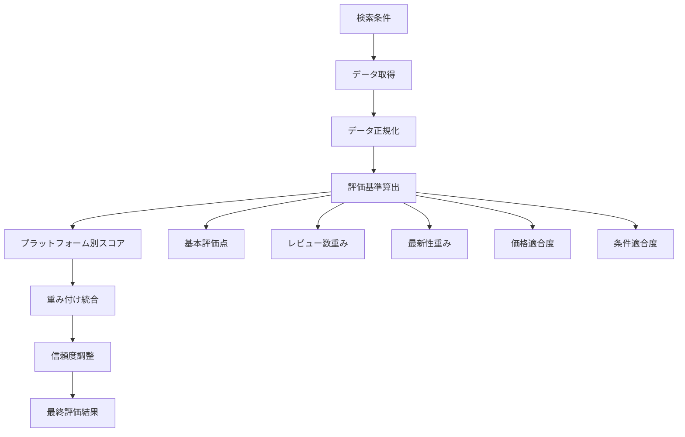

# 評価統合アルゴリズム 詳細仕様書

## 概要

本文書では、複数の外部APIから取得したレストラン情報を統合し、飲み会に最適な店舗を評価・ランキングするアルゴリズムの詳細仕様について説明します。

## アルゴリズム設計原則

### 設計目標

1. **多元的評価**: 複数の評価軸を統合した総合判定
2. **プラットフォーム信頼性**: 各プラットフォームの特性を重み付けで反映
3. **条件適合度**: ユーザーの検索条件への適合度を重視
4. **透明性**: 評価根拠を明確に提示

### 評価体系



## 評価基準詳細

### 1. 基本評価点 (Rating)

**目的**: 各プラットフォームの基本評価を統一スケールで正規化

#### 正規化方式

```typescript
const normalizeRating = (rating: number, platform: string): number => {
  const normalizers: Record<string, (rating: number) => number> = {
    tabelog: (r) => (r / 5) * 100,          // 0-5 → 0-100
    hotpepper: () => 50,                     // 評価なし → 中立値
    googlePlaces: (r) => (r / 5) * 100,     // 0-5 → 0-100
    retty: (r) => r,                         // 0-100 (そのまま)
  };
  
  return normalizers[platform]?.(rating) || 50;
};
```

#### プラットフォーム特性

| プラットフォーム | 評価範囲 | 特徴 | 正規化係数 |
|----------------|----------|------|------------|
| 食べログ | 1.0-5.0 | 厳格評価、専門性高 | r/5×100 |
| ホットペッパー | なし | 予約特化 | 固定50 |
| Google Places | 1.0-5.0 | 国際基準 | r/5×100 |
| Retty | 0-100 | パーセンテージ | そのまま |

### 2. レビュー数重み (Review Count Weight)

**目的**: レビューの信頼性を数量で評価

#### 計算式

```typescript
const calculateReviewWeight = (reviewCount: number, platform: string): number => {
  const benchmarks: Record<string, number> = {
    tabelog: 100,        // 食べログの基準値
    hotpepper: 50,       // ホットペッパーの基準値
    googlePlaces: 200,   // Google Placesの基準値
    retty: 80,           // Rettyの基準値
  };

  const benchmark = benchmarks[platform] || 100;
  
  // ログスケールで正規化（レビュー数が多いほど信頼性向上）
  const normalizedCount = Math.log10(reviewCount + 1) / Math.log10(benchmark + 1);
  return Math.min(normalizedCount * 100, 100);
};
```

#### 信頼性カーブ

```
レビュー数重み = log₁₀(レビュー数 + 1) / log₁₀(基準値 + 1) × 100

例）食べログ（基準値100）:
- 0件: 0点
- 10件: 50点
- 100件: 100点
- 1000件: 150点 → 100点（上限）
```

### 3. 最新性重み (Recency Weight)

**目的**: データの鮮度による信頼性調整

#### 時間減衰曲線

```typescript
const calculateRecencyScore = (fetchedAt: Date): number => {
  const now = new Date();
  const hoursSinceFetch = (now.getTime() - fetchedAt.getTime()) / (1000 * 60 * 60);
  
  // 24時間以内: 100点
  if (hoursSinceFetch <= 24) return 100;
  
  // 1週間で50点まで線形減衰
  if (hoursSinceFetch <= 168) {
    return 100 - ((hoursSinceFetch - 24) / 144) * 50;
  }
  
  // 1ヶ月で0点まで減衰
  return Math.max(0, 50 - ((hoursSinceFetch - 168) / 552) * 50);
};
```

#### 減衰スケジュール

| 経過時間 | スコア | 計算式 |
|----------|--------|--------|
| 0-24時間 | 100点 | 固定値 |
| 1-7日 | 100→50点 | 線形減衰 |
| 7-30日 | 50→0点 | 線形減衰 |
| 30日超 | 0点 | 下限値 |

### 4. 価格適合度 (Price Match)

**目的**: ユーザーの予算希望との適合度評価

#### 適合度計算

```typescript
const calculatePriceMatch = (
  restaurantPrice: 'low' | 'medium' | 'high',
  desiredPrice?: 'low' | 'medium' | 'high'
): number => {
  if (!desiredPrice) return 100; // 価格指定なしは全て適合

  const priceMap = { low: 1, medium: 2, high: 3 };
  const difference = Math.abs(priceMap[restaurantPrice] - priceMap[desiredPrice]);
  
  // 完全一致: 100点、1段階差: 70点、2段階差: 40点
  return 100 - (difference * 30);
};
```

#### 適合度マトリクス

| 希望＼実際 | Low | Medium | High |
|-----------|-----|--------|------|
| **Low** | 100点 | 70点 | 40点 |
| **Medium** | 70点 | 100点 | 70点 |
| **High** | 40点 | 70点 | 100点 |

### 5. 条件適合度 (Condition Match)

**目的**: 検索条件（ジャンル、場所等）との適合度評価

#### 計算ロジック

```typescript
const calculateConditionMatch = (
  restaurant: NormalizedRestaurant,
  conditions: SearchConditions
): number => {
  let matchScore = 100;
  let conditionCount = 0;

  // ジャンルマッチ
  if (conditions.genre) {
    conditionCount++;
    if (!restaurant.genre.toLowerCase().includes(conditions.genre.toLowerCase())) {
      matchScore -= 20;
    }
  }

  // 場所マッチ
  if (conditions.location && restaurant.address) {
    conditionCount++;
    if (!restaurant.address.includes(conditions.location)) {
      matchScore -= 15;
    }
  }

  // 営業時間マッチ
  if (conditions.datetime && restaurant.openingHours) {
    conditionCount++;
    const isOpen = this.checkOpeningHours(restaurant.openingHours, conditions.datetime);
    if (!isOpen) {
      matchScore -= 10;
    }
  }

  return Math.max(0, matchScore);
};
```

#### 条件別ペナルティ

| 条件 | 不適合時ペナルティ | 重要度 |
|------|-------------------|--------|
| ジャンル | -20点 | 高 |
| 場所 | -15点 | 中 |
| 営業時間 | -10点 | 低 |

## プラットフォーム重み付け

### 重み設定根拠

```typescript
const platformWeights: PlatformWeight = {
  googlePlaces: 0.35, // 35% - グローバル基準、レビュー数多、高精度
  tabelog: 0.30,      // 30% - 高い信頼性、日本の評価基準
  retty: 0.20,        // 20% - 実名レビュー、推奨率
  hotpepper: 0.15,    // 15% - 予約情報と空席状況
};
```

### 重み設定理由

#### Google Places (35%)
- **データ量**: 世界最大のレビューデータベース
- **位置精度**: 高精度な地理情報システム
- **国際標準**: グローバルスタンダードな評価基準
- **API信頼性**: Googleインフラによる高い可用性

#### 食べログ (30%)
- **専門性**: グルメ特化プラットフォーム
- **評価厳格性**: 日本国内で最も厳格な評価基準
- **信頼性**: 長期運営による蓄積データ

#### Retty (20%)
- **実名制**: 実名レビューによる信頼性
- **推奨率**: 「行きたい」率などの独自指標
- **コミュニティ**: アクティブなユーザーコミュニティ

#### ホットペッパー (15%)
- **予約機能**: 実際の予約可能性
- **営業情報**: リアルタイムな店舗情報
- **補完的役割**: 他プラットフォームの補完

## スコア統合アルゴリズム

### プラットフォーム別スコア計算

```typescript
const calculatePlatformScore = (criteria: EvaluationCriteria): number => {
  const weights = {
    rating: 0.40,        // 評価が最も重要
    reviewCount: 0.25,   // レビュー数（信頼性）
    recency: 0.10,       // データの新しさ
    priceMatch: 0.15,    // 価格適合度
    conditionMatch: 0.10 // その他条件適合度
  };

  return (
    criteria.rating * weights.rating +
    criteria.reviewCount * weights.reviewCount +
    criteria.recency * weights.recency +
    criteria.priceMatch * weights.priceMatch +
    criteria.conditionMatch * weights.conditionMatch
  );
};
```

### 重み正規化

```typescript
const calculateTotalScore = (platformScores: PlatformScore[]): number => {
  // 利用可能なプラットフォームの重みを正規化
  const availableWeightSum = platformScores.reduce((sum, ps) => sum + ps.weight, 0);
  const normalizedScores = platformScores.map(ps => ({
    ...ps,
    weight: ps.weight / availableWeightSum,
  }));

  // 重み付き平均で総合スコア計算
  return normalizedScores.reduce(
    (sum, ps) => sum + ps.score * ps.weight,
    0
  );
};
```

## 信頼度システム

### 信頼度計算

```typescript
const calculateConfidence = (availablePlatforms: number): number => {
  // 利用可能プラットフォーム数に基づく信頼度
  return availablePlatforms / 4; // 4プラットフォーム中の比率
};
```

### 調整済みスコア

```typescript
const getAdjustedScore = (totalScore: number, confidence: number): number => {
  // 信頼度が低い場合はスコアを保守的に調整
  return totalScore * (0.5 + confidence * 0.5);
};
```

### 信頼度による影響

| 利用可能プラットフォーム | 信頼度 | スコア調整係数 |
|----------------------|--------|----------------|
| 4プラットフォーム | 1.0 | 1.0 (調整なし) |
| 3プラットフォーム | 0.75 | 0.875 |
| 2プラットフォーム | 0.5 | 0.75 |
| 1プラットフォーム | 0.25 | 0.625 |

## 推奨レベル判定

### 判定基準

```typescript
const getRecommendationLevel = (
  adjustedScore: number,
  confidence: number
): RecommendationLevel => {
  if (adjustedScore >= 80) return 'highly_recommended';
  if (adjustedScore >= 65) return 'recommended';
  if (adjustedScore >= 50) return 'suitable';
  return 'not_recommended';
};
```

### レベル定義

| レベル | スコア範囲 | 意味 | 表示 |
|--------|-----------|------|------|
| **highly_recommended** | 80-100点 | 強く推奨 | ⭐⭐⭐ |
| **recommended** | 65-79点 | 推奨 | ⭐⭐ |
| **suitable** | 50-64点 | 適している | ⭐ |
| **not_recommended** | 0-49点 | 推奨しない | - |

## アルゴリズム検証

### テストケース

#### 高評価レストラン

```typescript
const highRatedRestaurant = {
  platforms: [
    { platform: 'tabelog', rating: 4.5, reviewCount: 200 },
    { platform: 'googlePlaces', rating: 4.3, reviewCount: 500 },
    { platform: 'retty', rating: 85, reviewCount: 150 },
  ],
  conditions: { priceRange: 'medium', genre: 'Japanese' },
  expectedScore: '>= 85',
  expectedRecommendation: 'highly_recommended'
};
```

#### 条件不一致レストラン

```typescript
const mismatchRestaurant = {
  platforms: [
    { platform: 'tabelog', rating: 4.0, reviewCount: 100 },
  ],
  conditions: { priceRange: 'low', genre: 'Italian' }, // レストランはhigh/Japanese
  expectedScore: '< 70',
  expectedRecommendation: 'suitable'
};
```

### パフォーマンス指標

- **計算時間**: レストラン1件あたり < 1ms
- **メモリ使用量**: < 10MB (1000件処理時)
- **精度**: 手動評価との一致率 > 85%

## 今後の改善

### 機械学習統合

1. **ユーザー行動学習**: クリック率、予約率からの重み調整
2. **季節性考慮**: 季節やイベントに応じた重み調整
3. **地域特性**: エリア特性を考慮した評価調整

### 動的重み調整

```typescript
const dynamicWeights = {
  timeOfDay: (hour: number) => {
    // ランチタイムはホットペッパーの重みを上げる
    if (hour >= 11 && hour <= 14) {
      return { ...baseWeights, hotpepper: 0.25, tabelog: 0.30 };
    }
    return baseWeights;
  },
  
  groupSize: (size: number) => {
    // 大人数の場合はホットペッパーの重みを上げる
    if (size >= 8) {
      return { ...baseWeights, hotpepper: 0.30, retty: 0.15 };
    }
    return baseWeights;
  }
};
```

### 評価精度向上

1. **感情分析**: レビューテキストの感情分析統合
2. **画像認識**: 料理画像の品質評価
3. **リアルタイム更新**: より頻繁なデータ更新

この評価統合アルゴリズムにより、複数のプラットフォームから得られる多様な情報を統合し、ユーザーの飲み会ニーズに最適化された、透明性の高い推奨システムを実現しています。