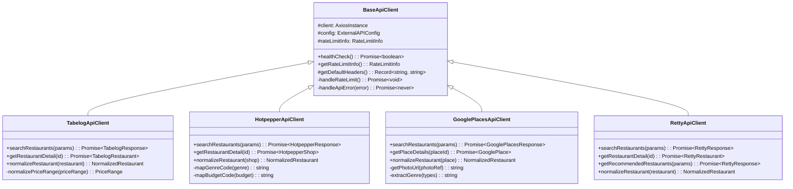

# 外部APIクライアント アーキテクチャ設計書

## 概要

本文書では、4つの外部API（食べログ、ホットペッパー、Google Places、Retty）を統合するためのクライアントアーキテクチャについて説明します。

## アーキテクチャ概要

### 設計原則

1. **統一インターフェース**: 全APIクライアントが共通の基底クラスを継承
2. **レート制限遵守**: 各API固有の制限を自動的に管理
3. **エラーハンドリング**: 統一されたエラー処理とリトライ機能
4. **データ正規化**: プラットフォーム間の差異を吸収

### クラス階層



## BaseApiClient 設計

### 責務

1. **HTTP通信管理**: Axios インスタンスの設定と管理
2. **レート制限制御**: API固有の制限に対する自動制御
3. **エラーハンドリング**: 統一されたエラー処理
4. **リトライ機能**: 一時的障害に対する自動リトライ

### レート制限アルゴリズム

```typescript
interface RateLimitInfo {
  remaining: number;  // 残りリクエスト数
  reset: Date;        // リセット時刻
  limit: number;      // 制限値
}

private async handleRateLimit(): Promise<void> {
  return new Promise((resolve) => {
    this.requestQueue.push(resolve);
    this.processQueue();
  });
}

private async processQueue(): Promise<void> {
  while (this.requestQueue.length > 0) {
    if (this.rateLimitInfo.remaining <= 0) {
      const waitTime = this.rateLimitInfo.reset.getTime() - Date.now();
      if (waitTime > 0) {
        await this.sleep(waitTime);
      }
      this.resetRateLimit();
    }
    
    const resolve = this.requestQueue.shift();
    this.rateLimitInfo.remaining--;
    resolve();
    
    // 分散処理でレート制限を遵守
    await this.sleep(1000 / this.config.rateLimit);
  }
}
```

### エラーハンドリング戦略

| HTTPステータス | 処理方法 | リトライ |
|---------------|----------|----------|
| 200-299 | 正常処理 | - |
| 401 | 認証エラー | なし |
| 404 | リソース不存在 | なし |
| 429 | レート制限超過 | 自動待機後リトライ |
| 500-599 | サーバーエラー | 指数バックオフリトライ |
| Network Error | ネットワークエラー | 線形バックオフリトライ |

## 各APIクライアント詳細

### TabelogApiClient

#### 特徴
- 高品質な評価データ
- 詳細なレビュー情報
- 日本国内特化

#### データ変換

```typescript
public normalizeRestaurant(restaurant: TabelogRestaurant): NormalizedRestaurant {
  return {
    externalId: restaurant.id,
    platform: 'tabelog',
    name: restaurant.name,
    genre: restaurant.category,
    address: restaurant.address,
    priceRange: this.normalizePriceRange(restaurant.priceRange),
    rating: restaurant.rating, // 0-5スケール
    reviewCount: restaurant.reviewCount,
    // ...
  };
}

private normalizePriceRange(priceRange: string): PriceRange {
  // "¥1,000～¥2,000" → { min: 1000, max: 2000, category: 'low' }
  const matches = priceRange.match(/¥([\d,]+)～¥([\d,]+)/);
  // 正規表現でパースして正規化
}
```

### HotpepperApiClient

#### 特徴
- 予約・空席情報
- パーティ対応情報
- リクルート運営

#### API パラメータマッピング

```typescript
private mapGenreCode(genre?: string): string | undefined {
  const genreMap: Record<string, string> = {
    'Japanese': 'G001',    // 和食
    'Italian': 'G006',     // イタリアン
    'Chinese': 'G007',     // 中華
    'Korean': 'G017',      // 韓国料理
    'Izakaya': 'G001',     // 居酒屋
  };
  return genreMap[genre];
}

private mapBudgetCode(budget?: string): string | undefined {
  const budgetMap: Record<string, string> = {
    'low': 'B001,B002',      // 〜2000円
    'medium': 'B003,B004',   // 2000-4000円
    'high': 'B005,B006',     // 4000円〜
  };
  return budgetMap[budget];
}
```

### GooglePlacesApiClient

#### 特徴
- グローバル対応
- 位置情報精度
- 大量レビューデータ

#### 検索モード

1. **Text Search**: キーワードベース検索
2. **Nearby Search**: 位置ベース検索
3. **Place Details**: 詳細情報取得

```typescript
public async searchRestaurants(params): Promise<GooglePlacesResponse> {
  if (params.query) {
    // テキスト検索
    return await this.client.get('/textsearch/json', { params });
  } else if (params.location) {
    // 近傍検索
    return await this.client.get('/nearbysearch/json', { params });
  }
}
```

### RettyApiClient

#### 特徴
- 実名レビューシステム
- 推奨率データ
- 飲み会特化情報

#### 推奨機能

```typescript
public async getRecommendedRestaurants(params: {
  area?: string;
  category?: string;
  occasion?: string;  // 'nomikai' 指定可能
  groupSize?: number;
}): Promise<RettyResponse> {
  return await this.client.get('/restaurants/recommended', {
    params: {
      ...params,
      occasion: params.occasion || 'nomikai', // デフォルトで飲み会
    },
  });
}
```

## データ正規化

### 統一データモデル

```typescript
interface NormalizedRestaurant {
  externalId: string;     // 各プラットフォームのID
  platform: Platform;    // プラットフォーム識別子
  name: string;           // レストラン名
  genre: string;          // ジャンル（統一）
  address: string;        // 住所
  priceRange: {           // 価格帯（統一）
    min: number;
    max: number;
    category: 'low' | 'medium' | 'high';
  };
  rating: number;         // 評価（0-5スケール統一）
  reviewCount: number;    // レビュー数
  coordinates?: {         // 座標（あれば）
    lat: number;
    lng: number;
  };
  openingHours?: string;  // 営業時間
  capacity?: number;      // 収容人数
  url: string;           // 詳細ページURL
  imageUrl?: string;     // 画像URL
  fetchedAt: Date;       // 取得日時
}
```

### 正規化ルール

#### 評価スケール統一

| プラットフォーム | 元スケール | 正規化方法 |
|----------------|------------|------------|
| 食べログ | 0-5 | そのまま |
| ホットペッパー | なし | N/A（0固定） |
| Google Places | 0-5 | そのまま |
| Retty | 0-100 | `/20`で0-5に変換 |

#### 価格カテゴリ統一

| カテゴリ | 価格帯 | 基準 |
|----------|--------|------|
| low | ～1,500円 | ランチ・カジュアル |
| medium | 1,500～3,000円 | 一般的な飲み会 |
| high | 3,000円～ | 高級・特別な場面 |

## パフォーマンス最適化

### 並列処理

```typescript
public async fetchFromAllAPIs(params): Promise<{
  restaurants: NormalizedRestaurant[];
  platformsUsed: string[];
}> {
  const apiCalls = [
    this.fetchFromTabelog(params),
    this.fetchFromHotpepper(params),
    this.fetchFromGooglePlaces(params),
    this.fetchFromRetty(params),
  ];

  // Promise.allSettled で部分失敗を許容
  const results = await Promise.allSettled(apiCalls);
  
  const restaurants: NormalizedRestaurant[] = [];
  const platformsUsed: string[] = [];

  results.forEach((result, index) => {
    if (result.status === 'fulfilled' && result.value) {
      restaurants.push(...result.value);
      platformsUsed.push(['tabelog', 'hotpepper', 'googlePlaces', 'retty'][index]);
    }
  });

  return { restaurants, platformsUsed };
}
```

### 接続プール設定

```typescript
this.client = axios.create({
  baseURL: this.config.endpoint,
  timeout: this.config.timeout,
  maxRedirects: 3,
  // HTTP Keep-Alive for connection reuse
  headers: {
    'Connection': 'keep-alive',
    'Keep-Alive': 'timeout=5, max=1000'
  }
});
```

## 設定管理

### 環境変数

```bash
# 食べログ
TABELOG_API_ENDPOINT=https://api.tabelog.com/v1
TABELOG_API_KEY=your_api_key
TABELOG_RATE_LIMIT=60
TABELOG_TIMEOUT=10000

# ホットペッパー
HOTPEPPER_API_ENDPOINT=https://webservice.recruit.co.jp/hotpepper
HOTPEPPER_API_KEY=your_api_key
HOTPEPPER_RATE_LIMIT=100
HOTPEPPER_TIMEOUT=10000

# Google Places
GOOGLE_PLACES_API_ENDPOINT=https://maps.googleapis.com/maps/api/place
GOOGLE_PLACES_API_KEY=your_api_key
GOOGLE_PLACES_RATE_LIMIT=100
GOOGLE_PLACES_TIMEOUT=10000

# Retty
RETTY_API_ENDPOINT=https://api.retty.me/v1
RETTY_API_KEY=your_api_key
RETTY_RATE_LIMIT=60
RETTY_TIMEOUT=10000
```

### 設定検証

```typescript
const validateApiConfig = (config: ExternalAPIConfig): void => {
  if (!config.endpoint) throw new Error('API endpoint is required');
  if (!config.apiKey) console.warn('API key is missing - some features may not work');
  if (config.rateLimit <= 0) throw new Error('Rate limit must be positive');
  if (config.timeout <= 0) throw new Error('Timeout must be positive');
};
```

## 監視・ログ

### ヘルスチェック

```typescript
public async healthCheck(): Promise<{
  status: 'healthy' | 'degraded' | 'unhealthy';
  responseTime: number;
  rateLimit: RateLimitInfo;
}> {
  const start = Date.now();
  
  try {
    await this.client.get('/health', { timeout: 5000 });
    return {
      status: 'healthy',
      responseTime: Date.now() - start,
      rateLimit: this.getRateLimitInfo(),
    };
  } catch (error) {
    return {
      status: 'unhealthy',
      responseTime: Date.now() - start,
      rateLimit: this.getRateLimitInfo(),
    };
  }
}
```

### ログ出力

```typescript
private logApiCall(method: string, url: string, duration: number, success: boolean): void {
  console.log(`[${this.name}] ${method} ${url} - ${duration}ms - ${success ? 'SUCCESS' : 'FAILED'}`);
  
  // メトリクス収集（将来の拡張）
  if (this.metricsCollector) {
    this.metricsCollector.recordApiCall({
      platform: this.name,
      method,
      url,
      duration,
      success,
    });
  }
}
```

## 今後の拡張

### 新API追加手順

1. `BaseApiClient`を継承したクライアントクラス作成
2. プラットフォーム固有の`normalizeRestaurant`メソッド実装
3. 環境変数設定追加
4. `ApiIntegrationService`に統合
5. テストケース作成

### 機能拡張ポイント

- **キャッシュ機能**: レスポンスレベルでのキャッシュ
- **リトライ戦略**: より高度なリトライロジック
- **メトリクス収集**: API使用状況の詳細分析
- **A/Bテスト**: 複数の統合アルゴリズムのテスト

この設計により、拡張性と保守性を確保しながら、複数の外部APIを効率的に統合できるアーキテクチャを実現しています。