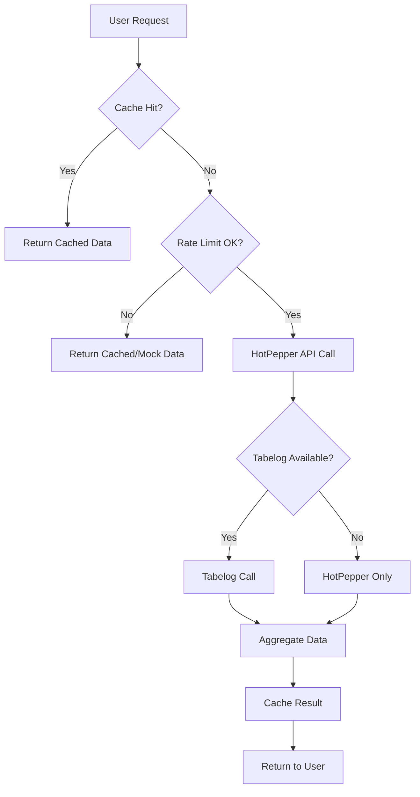

# HotPepper中心アーキテクチャ設計書

**作成日**: 2025年6月21日  
**更新日**: 2025年6月21日  
**目的**: 完全無料での持続可能なレストラン評価システム構築  
**設計方針**: HotPepper API中心、食べログ補助、Google Places無効

---

## 🎯 **設計概要**

### **基本方針**
```yaml
Primary Platform: HotPepper API (完全無料)
Secondary Platform: 食べログ (個人利用、週次制限)
Disabled Platform: Google Places API (有料のため無効化)

Architecture Philosophy:
  - 無料での持続可能性を最優先
  - 積極的キャッシュによるAPI呼び出し最小化
  - ユーザー体験の品質維持
  - 段階的スケーラビリティ
```

### **重み付け設定**
```yaml
Platform Weights:
  HotPepper: 70% (メイン情報源)
  食べログ: 20% (補助情報・品質向上)
  Google: 10% (将来の有料プラン用・現在は無効)

Rationale:
  - HotPepper: 無料かつ包括的な店舗情報
  - 食べログ: 高品質レビューと評価（制限内利用）
  - Google: 有料のため無料版では使用しない
```

---

## 🏗️ **システムアーキテクチャ**

### **レイヤー構成**
```
┌─────────────────────────────────────────┐
│              Frontend Layer             │
│  ┌─────────────────────────────────────┐ │
│  │ FreeTierBadge | UnifiedRatingDisplay│ │
│  │ HotPepper-centric UI Components    │ │
│  └─────────────────────────────────────┘ │
└─────────────────────────────────────────┘
                      │
┌─────────────────────────────────────────┐
│            Service Layer                │
│  ┌─────────────────────────────────────┐ │
│  │    FreeTierRatingService            │ │
│  │  - HotPepper Primary Logic          │ │
│  │  - Tabelog Secondary Logic          │ │
│  │  - Rate Limiting & Caching          │ │
│  └─────────────────────────────────────┘ │
└─────────────────────────────────────────┘
                      │
┌─────────────────────────────────────────┐
│              Cache Layer                │
│  ┌─────────────────────────────────────┐ │
│  │  FreeTierCacheStrategy              │ │
│  │  - Aggressive Caching (48h-7d)     │ │
│  │  - Off-peak Pre-loading             │ │
│  │  - Memory Optimization              │ │
│  └─────────────────────────────────────┘ │
└─────────────────────────────────────────┘
                      │
┌─────────────────────────────────────────┐
│              API Layer                  │
│  ┌───────────────┐ ┌─────────────────┐   │
│  │ HotPepper API │ │ Tabelog Scraper │   │
│  │ (Unlimited)   │ │ (50 req/week)   │   │
│  └───────────────┘ └─────────────────┘   │
└─────────────────────────────────────────┘
```

### **データフロー**


---

## 📊 **利用制限管理**

### **HotPepper API制限**
```typescript
const HOTPEPPER_LIMITS = {
  requestsPerMinute: 2,     // 30秒間隔
  requestsPerHour: 50,      // 1時間50回
  requestsPerDay: 300,      // 1日300回
  concurrent: 1,            // 同時接続1つ
};

// 実装例
class HotPepperRateLimit {
  private counters = {
    minute: 0, hour: 0, day: 0,
    lastReset: { minute: 0, hour: 0, day: 0 }
  };
  
  canMakeRequest(): boolean {
    this.resetCountersIfNeeded();
    return (
      this.counters.minute < HOTPEPPER_LIMITS.requestsPerMinute &&
      this.counters.hour < HOTPEPPER_LIMITS.requestsPerHour &&
      this.counters.day < HOTPEPPER_LIMITS.requestsPerDay
    );
  }
}
```

### **食べログ制限**
```typescript
const TABELOG_LIMITS = {
  requestsPerWeek: 50,      // 週50回まで
  requestInterval: 30000,   // 30秒間隔必須
  personalUseOnly: true,    // 個人利用のみ
  basicInfoOnly: true,      // 基本情報のみ
};

// 実装例
class TabelogRateLimit {
  private weeklyCount = 0;
  private lastWeekReset = 0;
  
  canMakeRequest(): boolean {
    const now = Date.now();
    const weekInMs = 7 * 24 * 60 * 60 * 1000;
    
    if (now - this.lastWeekReset > weekInMs) {
      this.weeklyCount = 0;
      this.lastWeekReset = now;
    }
    
    return this.weeklyCount < TABELOG_LIMITS.requestsPerWeek;
  }
}
```

---

## 💾 **キャッシュ戦略**

### **積極的キャッシュ設定**
```yaml
HotPepper Cache:
  restaurant_detail: 48時間  # 2日間
  search_results: 6時間     # 半日
  popular_data: 24時間      # 1日間

Tabelog Cache:
  restaurant_detail: 7日間   # 1週間
  search_results: 24時間    # 1日間
  batch_data: 14日間        # 2週間（緊急時）

Unified Cache:
  rating_data: 12時間       # 半日
  search_results: 3時間     # 3時間
```

### **キャッシュ最適化戦略**
```typescript
class FreeTierCacheOptimization {
  // 1. 事前キャッシュ（オフピーク時間）
  async preloadPopularData() {
    const offPeakHours = [2, 3, 4, 5, 6]; // 深夜早朝
    if (offPeakHours.includes(new Date().getHours())) {
      await this.preloadTopRestaurants();
      await this.preloadPopularSearches();
    }
  }
  
  // 2. 使用パターン学習
  optimizeBasedOnUsage(userPatterns) {
    // よく検索される地域・ジャンルを優先キャッシュ
    userPatterns.popularSearches.forEach(pattern => {
      this.extendCacheFor(pattern);
    });
  }
  
  // 3. メモリ効率化
  optimizeMemoryUsage() {
    if (this.getMemoryUsage() > 50) { // 50MB制限
      this.cleanupOldEntries();
      this.compressLargeData();
    }
  }
}
```

---

## 🔄 **データ更新戦略**

### **リアルタイム vs バッチ更新**
```yaml
Real-time Updates (HotPepper):
  - 新規検索リクエスト
  - ユーザーが直接アクセスした店舗
  - キャッシュミス時の補完

Batch Updates (Tabelog):
  - 週次バッチ（金曜夜または土曜早朝）
  - 人気店舗優先（アクセス数順）
  - 最大50件/週の制限内

No Updates (Google):
  - 無料版では無効
  - 既存キャッシュデータのみ表示
  - 将来の有料プランで有効化予定
```

### **バッチ更新スケジュール**
```typescript
class WeeklyUpdateScheduler {
  schedule() {
    // 毎週金曜日 23:00 に実行
    cron.schedule('0 23 * * 5', async () => {
      await this.executeWeeklyTabelogUpdate();
    });
  }
  
  async executeWeeklyTabelogUpdate() {
    const popularRestaurants = await this.getPopularRestaurants(50);
    
    for (const restaurant of popularRestaurants) {
      await new Promise(resolve => setTimeout(resolve, 30000)); // 30秒間隔
      
      try {
        await this.updateTabelogData(restaurant.id);
      } catch (error) {
        console.log(`Tabelog update failed for ${restaurant.id}`);
      }
    }
  }
}
```

---

## 🎨 **UI/UX設計**

### **無料版向けUI特徴**
```yaml
Design Principles:
  - HotPepperデータを主役として表示
  - 食べログデータは補助情報として控えめに表示
  - 無料版であることを適切に表示
  - 利用制限の透明性を確保

Components:
  - FreeTierBadge: 無料版表示
  - UnifiedRatingDisplay: HotPepper中心表示
  - UsageMeter: API利用状況表示
  - PlatformAttribution: データ帰属の明示
```

### **表示優先度**
```typescript
const DISPLAY_PRIORITY = {
  // 最優先表示
  primary: {
    source: 'hotpepper',
    fields: ['name', 'genre', 'rating', 'price', 'location'],
    prominence: 'large',
  },
  
  // 補助表示
  secondary: {
    source: 'tabelog',
    fields: ['rating', 'review_count'],
    prominence: 'small',
    label: '食べログ参考値',
  },
  
  // 非表示（無料版）
  disabled: {
    source: 'google',
    reason: '有料プランで利用可能',
    fallback: 'hotpepper_data',
  }
};
```

---

## 📈 **パフォーマンス目標**

### **レスポンス時間**
```yaml
Cache Hit Response: < 100ms
HotPepper API Response: < 2000ms
Tabelog Response: < 5000ms (制限あり)
Search Results: < 1500ms
Page Load: < 3000ms
```

### **可用性目標**
```yaml
Service Availability: 99.5%
Cache Hit Rate: 85%+ (HotPepper)
Cache Hit Rate: 95%+ (Tabelog)
Error Rate: < 5%
Successful Request Rate: > 95%
```

### **スケーラビリティ制限**
```yaml
Concurrent Users: ~100-500
Monthly Searches: ~10,000-50,000
Daily HotPepper Requests: ~300
Weekly Tabelog Requests: ~50
Memory Usage: < 100MB
```

---

## 🔒 **リスク管理**

### **技術的リスク**
```yaml
High Risk:
  - HotPepper API利用制限変更
  - 食べログサイト構造変更
  - レート制限の強化

Medium Risk:
  - キャッシュデータの整合性
  - メモリ使用量の増大
  - ネットワーク障害

Low Risk:
  - UI表示の不具合
  - キャッシュの期限切れ
  - 軽微なAPI仕様変更
```

### **対策・緩和策**
```typescript
class RiskMitigation {
  // HotPepper API障害時の対策
  handleHotPepperFailure() {
    return {
      immediate: 'キャッシュデータで継続運用',
      shortTerm: 'モックデータでサービス維持',
      longTerm: '代替データソースの検討',
    };
  }
  
  // 食べログアクセス制限時の対策
  handleTabelogRestriction() {
    return {
      immediate: '既存キャッシュの期間延長',
      shortTerm: 'HotPepperデータのみで運用',
      longTerm: 'ユーザー生成データの導入',
    };
  }
  
  // メモリ不足時の対策
  handleMemoryPressure() {
    return {
      immediate: '古いキャッシュの削除',
      shortTerm: 'キャッシュサイズの制限',
      longTerm: '外部キャッシュシステムの導入',
    };
  }
}
```

---

## 🚀 **将来的な拡張計画**

### **Phase 1: 無料版安定化（現在）**
```yaml
Goals:
  - HotPepper中心システムの完成
  - 積極的キャッシュ戦略の実装
  - 無料での持続可能な運用確立

Deliverables:
  - FreeTierRatingService
  - FreeTierCacheStrategy
  - HotPepper-centric UI
```

### **Phase 2: ユーザー機能拡張（3-6ヶ月後）**
```yaml
Goals:
  - ユーザー評価・レビュー機能
  - お気に入り・ブックマーク機能
  - 個人化されたレコメンデーション

Benefits:
  - 外部API依存の軽減
  - ユーザーエンゲージメント向上
  - 独自データの蓄積
```

### **Phase 3: 有料プラン導入（6-12ヶ月後）**
```yaml
Goals:
  - Google Places API復活
  - リアルタイム更新
  - 高度な分析機能

Revenue Model:
  - 月額課金プラン
  - 企業向けAPI提供
  - プレミアム機能
```

---

## 📋 **運用・監視**

### **監視項目**
```yaml
API Usage Monitoring:
  - HotPepper日次利用量
  - 食べログ週次利用量
  - レート制限到達回数
  - エラー率

Performance Monitoring:
  - レスポンス時間
  - キャッシュヒット率
  - メモリ使用量
  - CPU使用率

User Experience Monitoring:
  - ページロード時間
  - 検索成功率
  - ユーザー満足度
  - 離脱率
```

### **アラート設定**
```typescript
const ALERTS = {
  critical: {
    hotpepper_api_failure: '即座にSlack通知',
    memory_usage_90_percent: 'システム管理者にメール',
    error_rate_over_10_percent: '開発チームに通知',
  },
  
  warning: {
    cache_hit_rate_below_80: '日次レポートに記載',
    daily_api_limit_80_percent: 'ダッシュボードに表示',
    tabelog_weekly_limit_reached: 'ログに記録',
  },
};
```

---

## 📊 **成功指標 (KPI)**

### **技術指標**
```yaml
Availability: 99.5%以上
Response Time: 平均2秒以下
Cache Hit Rate: 85%以上
Error Rate: 5%以下
API Cost: 月額0円維持
```

### **ビジネス指標**
```yaml
Monthly Active Users: 1,000人以上
Search Success Rate: 95%以上
User Retention Rate: 60%以上
Average Session Duration: 3分以上
User Satisfaction Score: 4.0/5.0以上
```

### **運用指標**
```yaml
Deployment Frequency: 週1回以上
Mean Time to Recovery: 2時間以下
Change Failure Rate: 5%以下
Development Velocity: 月10機能以上
Bug Discovery Rate: 月5件以下
```

---

**最終更新**: 2025年6月21日  
**次回レビュー**: 2025年9月21日  
**承認者**: 開発チーム  
**関連ドキュメント**: 
- [API Cost Analysis](./api-cost-analysis.md)
- [Free Tier Analysis](./free-tier-analysis.md)
- [Phase 7 Development Log](./phase7-development-log.md)