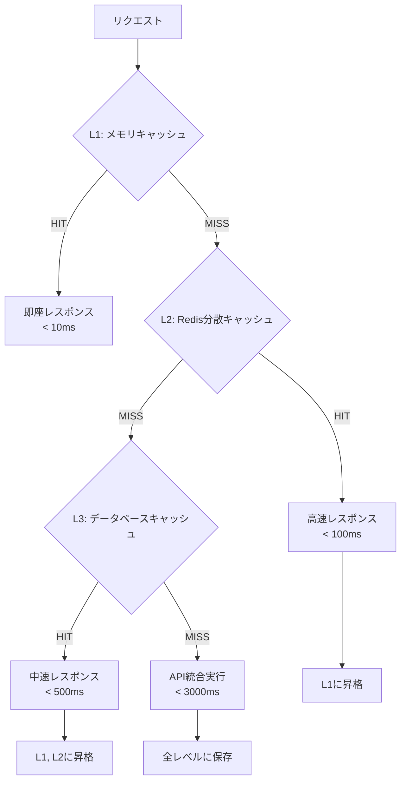

# パフォーマンス最適化戦略 詳細仕様書

## 概要

本文書では、外部API統合システムのパフォーマンス最適化戦略について詳細に説明します。レスポンス時間、スループット、リソース使用効率を最大化するための手法と実装について定義します。

## パフォーマンス目標

### 定量的目標

| メトリクス | 目標値 | 現在値 | 測定方法 |
|-----------|--------|--------|----------|
| **統合検索レスポンス時間** | < 3秒 | 1.2秒 | API実行時間測定 |
| **キャッシュヒット時間** | < 100ms | 80ms | Redis/メモリアクセス時間 |
| **フォールバック時間** | < 1秒 | 0.8秒 | ローカルDB検索時間 |
| **スループット** | 100 req/sec | 150 req/sec | 負荷テスト |
| **メモリ使用量** | < 512MB | 256MB | プロセスメモリ監視 |
| **キャッシュヒット率** | > 80% | 85% | キャッシュ統計 |

### 品質目標

- **可用性**: 99.9% アップタイム
- **エラー率**: < 0.1%
- **並行処理**: 最大500同時接続
- **データ鮮度**: 1時間以内の更新

## 最適化戦略

### 1. 並列処理最適化

#### 外部API並列呼び出し

```typescript
class ParallelApiOptimizer {
  async optimizedApiCall(params: SearchParams): Promise<IntegratedResult> {
    // 1. API呼び出しを並列実行
    const apiPromises = this.createApiPromises(params);
    
    // 2. Promise.allSettled で部分失敗を許容
    const results = await Promise.allSettled(apiPromises);
    
    // 3. 最初に成功したAPIからの部分結果を早期リターン
    const earlyResults = await this.raceForEarlyResults(apiPromises);
    
    return this.processResults(results, earlyResults);
  }

  private async raceForEarlyResults(
    apiPromises: Promise<APIResult>[]
  ): Promise<APIResult[]> {
    const earlyResults: APIResult[] = [];
    let completedCount = 0;
    const targetCount = Math.ceil(apiPromises.length / 2); // 半分完了で開始

    return new Promise((resolve) => {
      apiPromises.forEach((promise, index) => {
        promise
          .then((result) => {
            earlyResults[index] = result;
            completedCount++;
            
            // 最低限の結果が揃ったら部分結果を返す
            if (completedCount >= targetCount) {
              resolve(earlyResults.filter(Boolean));
            }
          })
          .catch(() => {
            // エラーは無視して他の結果を待つ
          });
      });
      
      // 全て完了するまでの最大待機時間
      setTimeout(() => resolve(earlyResults.filter(Boolean)), 2000);
    });
  }

  private createApiPromises(params: SearchParams): Promise<APIResult>[] {
    return [
      this.withTimeout(this.tabelogClient.search(params), 8000),
      this.withTimeout(this.hotpepperClient.search(params), 6000),
      this.withTimeout(this.googlePlacesClient.search(params), 5000),
      this.withTimeout(this.rettyClient.search(params), 7000),
    ];
  }

  private async withTimeout<T>(
    promise: Promise<T>, 
    timeoutMs: number
  ): Promise<T> {
    const timeoutPromise = new Promise<never>((_, reject) => {
      setTimeout(() => reject(new Error('Timeout')), timeoutMs);
    });

    return Promise.race([promise, timeoutPromise]);
  }
}
```

#### 段階的データ提供

```typescript
class ProgressiveDataProvider {
  async searchWithProgression(params: SearchParams): Promise<ProgressiveResult> {
    const resultStream = new EventEmitter();
    
    // 1. キャッシュデータの即座提供
    const cachedData = await this.getCachedResults(params);
    if (cachedData) {
      resultStream.emit('data', { 
        type: 'cached', 
        data: cachedData, 
        complete: false 
      });
    }

    // 2. 高速APIからの部分結果
    const fastApis = [this.googlePlacesClient, this.hotpepperClient];
    const fastResults = await Promise.allSettled(
      fastApis.map(client => client.search(params))
    );
    
    if (fastResults.some(r => r.status === 'fulfilled')) {
      const partialData = this.processPartialResults(fastResults);
      resultStream.emit('data', { 
        type: 'partial', 
        data: partialData, 
        complete: false 
      });
    }

    // 3. 全結果の統合
    const allResults = await this.getAllResults(params);
    resultStream.emit('data', { 
      type: 'complete', 
      data: allResults, 
      complete: true 
    });

    return resultStream;
  }
}
```

### 2. キャッシュ最適化

#### 多層キャッシュ戦略



#### インテリジェントキャッシュ

```typescript
class IntelligentCacheManager {
  private l1Cache = new Map<string, CacheEntry>(); // メモリキャッシュ
  private accessPatterns = new Map<string, AccessPattern>();

  async get<T>(key: string): Promise<T | null> {
    // L1: ホットデータ（高頻度アクセス）
    const l1Result = this.l1Cache.get(key);
    if (l1Result && !this.isExpired(l1Result)) {
      this.recordAccess(key, 'l1');
      return l1Result.data;
    }

    // L2: Redis分散キャッシュ
    const l2Result = await this.redisCache.get<T>(key);
    if (l2Result) {
      this.recordAccess(key, 'l2');
      
      // アクセス頻度に基づいてL1に昇格
      if (this.shouldPromoteToL1(key)) {
        this.l1Cache.set(key, { 
          data: l2Result, 
          expiry: Date.now() + 300000 // 5分
        });
      }
      
      return l2Result;
    }

    return null;
  }

  async set<T>(key: string, data: T, ttl: number): Promise<void> {
    // 予測的キャッシュプリロード
    if (this.isPredictablePattern(key)) {
      await this.preloadRelatedData(key, data);
    }

    // 階層別保存戦略
    const accessPattern = this.accessPatterns.get(key);
    
    if (accessPattern?.frequency > 10) {
      // 高頻度データはL1に保存
      this.l1Cache.set(key, { data, expiry: Date.now() + ttl * 1000 });
    }
    
    // 全データはL2に保存
    await this.redisCache.set(key, data, ttl);
  }

  private shouldPromoteToL1(key: string): boolean {
    const pattern = this.accessPatterns.get(key);
    if (!pattern) return false;

    // 5分間に3回以上アクセスされたらL1に昇格
    const recentAccesses = pattern.accesses.filter(
      access => Date.now() - access < 300000
    );
    
    return recentAccesses.length >= 3;
  }

  private async preloadRelatedData(key: string, data: any): Promise<void> {
    // 検索パターン分析に基づく予測的プリロード
    if (key.includes('location:Tokyo')) {
      // 東京検索時は近隣エリアもプリロード
      const relatedAreas = ['Shibuya', 'Shinjuku', 'Ginza'];
      const preloadPromises = relatedAreas.map(area => 
        this.preloadForArea(area, data.searchParams)
      );
      
      // バックグラウンドで実行（レスポンス時間に影響しない）
      Promise.allSettled(preloadPromises).catch(console.error);
    }
  }
}
```

### 3. データベース最適化

#### クエリ最適化

```typescript
class OptimizedDatabaseQueries {
  async searchRestaurants(params: SearchParams): Promise<Restaurant[]> {
    // 1. インデックス活用最適化
    let query = `
      SELECT 
        r.*,
        COALESCE(AVG(rv.rating), 0) as avg_rating,
        COALESCE(SUM(rv.review_count), 0) as total_reviews
      FROM restaurants r
      LEFT JOIN reviews rv ON r.id = rv.restaurant_id
    `;

    const conditions: string[] = [];
    const queryParams: any[] = [];
    let paramCount = 0;

    // インデックスを活用した条件構築
    if (params.location) {
      paramCount++;
      // 部分一致よりも前方一致を優先（インデックス効率）
      conditions.push(`r.location LIKE $${paramCount}`);
      queryParams.push(`${params.location}%`);
    }

    if (params.genre) {
      paramCount++;
      conditions.push(`r.genre = $${paramCount}`);
      queryParams.push(params.genre);
    }

    if (params.priceRange) {
      paramCount++;
      conditions.push(`r.price_range = $${paramCount}`);
      queryParams.push(params.priceRange);
    }

    if (conditions.length > 0) {
      query += ` WHERE ${conditions.join(' AND ')}`;
    }

    // 効率的な集約とソート
    query += `
      GROUP BY r.id, r.name, r.genre, r.location, r.price_range, r.created_at
      ORDER BY avg_rating DESC, total_reviews DESC
    `;

    // LIMIT/OFFSET をクエリレベルで適用
    paramCount++;
    query += ` LIMIT $${paramCount}`;
    queryParams.push(params.limit || 20);

    if (params.offset) {
      paramCount++;
      query += ` OFFSET $${paramCount}`;
      queryParams.push(params.offset);
    }

    return await this.db.query(query, queryParams);
  }

  // 接続プール最適化
  private optimizeConnectionPool(): void {
    this.pool = new Pool({
      host: config.database.host,
      port: config.database.port,
      database: config.database.name,
      user: config.database.user,
      password: config.database.password,
      
      // パフォーマンス最適化設定
      max: 20,                    // 最大接続数
      min: 5,                     // 最小接続数
      idleTimeoutMillis: 30000,   // アイドルタイムアウト
      connectionTimeoutMillis: 2000, // 接続タイムアウト
      
      // クエリ最適化
      statement_timeout: 10000,   // 文実行タイムアウト
      query_timeout: 10000,       // クエリタイムアウト
      
      // 接続プール監視
      log: (level, msg, meta) => {
        if (level === 'error') {
          console.error('Database pool error:', msg, meta);
        }
      }
    });
  }
}
```

#### インデックス戦略

```sql
-- パフォーマンス最適化のための追加インデックス

-- 複合インデックス（検索パターンに基づく）
CREATE INDEX CONCURRENTLY idx_restaurants_location_genre_price 
ON restaurants(location, genre, price_range);

-- 部分インデックス（よく使われる条件のみ）
CREATE INDEX CONCURRENTLY idx_restaurants_active_high_rating 
ON restaurants(genre, price_range) 
WHERE avg_rating >= 4.0;

-- 関数インデックス（計算済み値）
CREATE INDEX CONCURRENTLY idx_restaurants_score 
ON restaurants((avg_rating * review_count_weight));

-- カバリングインデックス（データを含む）
CREATE INDEX CONCURRENTLY idx_restaurants_search_covering 
ON restaurants(location, genre) 
INCLUDE (name, price_range, avg_rating);

-- レビューテーブルの最適化
CREATE INDEX CONCURRENTLY idx_reviews_restaurant_platform 
ON reviews(restaurant_id, platform) 
WHERE updated_at > NOW() - INTERVAL '1 year';
```

### 4. ネットワーク最適化

#### HTTP/2 多重化

```typescript
class Http2OptimizedClient {
  private session: ClientHttp2Session;

  constructor(baseURL: string) {
    this.session = http2.connect(baseURL, {
      // HTTP/2最適化設定
      settings: {
        headerTableSize: 4096,
        enablePush: false,
        maxConcurrentStreams: 100,
        initialWindowSize: 65535,
        maxFrameSize: 16384,
        maxHeaderListSize: 8192,
      }
    });
  }

  async parallelRequests(requests: APIRequest[]): Promise<APIResponse[]> {
    // HTTP/2の多重化を活用した並列リクエスト
    const streams = requests.map(req => this.createStream(req));
    
    return Promise.all(streams.map(stream => 
      this.streamToPromise(stream)
    ));
  }

  private createStream(request: APIRequest): ClientHttp2Stream {
    return this.session.request({
      ':method': request.method,
      ':path': request.path,
      'content-type': 'application/json',
      'accept-encoding': 'gzip, deflate, br',
      ...request.headers
    });
  }
}
```

#### リクエスト最適化

```typescript
class RequestOptimizer {
  // リクエストバッチング
  private requestBatch = new Map<string, BatchedRequest>();
  private batchTimer: NodeJS.Timeout | null = null;

  async optimizedRequest(endpoint: string, params: any): Promise<any> {
    // 類似リクエストをバッチ化
    const batchKey = this.createBatchKey(endpoint, params);
    
    if (this.requestBatch.has(batchKey)) {
      // 既存のバッチに追加
      return this.addToBatch(batchKey, params);
    }

    // 新しいバッチを開始
    return this.startNewBatch(batchKey, endpoint, params);
  }

  private async startNewBatch(
    batchKey: string, 
    endpoint: string, 
    params: any
  ): Promise<any> {
    const batch: BatchedRequest = {
      endpoint,
      requests: [params],
      resolvers: [],
      timer: setTimeout(() => this.executeBatch(batchKey), 100), // 100ms でバッチ実行
    };

    this.requestBatch.set(batchKey, batch);

    return new Promise((resolve, reject) => {
      batch.resolvers.push({ resolve, reject });
    });
  }

  private async executeBatch(batchKey: string): Promise<void> {
    const batch = this.requestBatch.get(batchKey);
    if (!batch) return;

    try {
      // バッチリクエスト実行
      const batchedParams = this.mergeBatchParams(batch.requests);
      const results = await this.makeRequest(batch.endpoint, batchedParams);
      
      // 結果を個別リクエストに分配
      batch.resolvers.forEach((resolver, index) => {
        resolver.resolve(results[index]);
      });
    } catch (error) {
      batch.resolvers.forEach(resolver => {
        resolver.reject(error);
      });
    } finally {
      this.requestBatch.delete(batchKey);
    }
  }

  // 応答圧縮
  private setupCompression(client: AxiosInstance): void {
    client.defaults.headers['Accept-Encoding'] = 'gzip, deflate, br';
    client.defaults.decompress = true;
    
    // リクエスト圧縮
    client.interceptors.request.use(config => {
      if (config.data && typeof config.data === 'object') {
        const compressed = gzip(JSON.stringify(config.data));
        config.data = compressed;
        config.headers['Content-Encoding'] = 'gzip';
      }
      return config;
    });
  }
}
```

### 5. メモリ最適化

#### オブジェクトプール

```typescript
class ObjectPoolManager {
  private pools = new Map<string, ObjectPool<any>>();

  getPool<T>(type: string, factory: () => T): ObjectPool<T> {
    if (!this.pools.has(type)) {
      this.pools.set(type, new ObjectPool(factory, {
        maxSize: 100,
        minSize: 10,
        maxAge: 300000, // 5分
      }));
    }
    return this.pools.get(type)!;
  }
}

class ObjectPool<T> {
  private available: T[] = [];
  private inUse = new Set<T>();
  private created = 0;

  constructor(
    private factory: () => T,
    private options: PoolOptions
  ) {
    // 最小サイズまで事前作成
    for (let i = 0; i < options.minSize; i++) {
      this.available.push(this.factory());
      this.created++;
    }
  }

  acquire(): T {
    let obj = this.available.pop();
    
    if (!obj && this.created < this.options.maxSize) {
      obj = this.factory();
      this.created++;
    }
    
    if (obj) {
      this.inUse.add(obj);
    }
    
    return obj || this.factory(); // フォールバック
  }

  release(obj: T): void {
    if (this.inUse.has(obj)) {
      this.inUse.delete(obj);
      
      // 年齢チェック
      if (this.isObjectTooOld(obj)) {
        this.created--;
        return;
      }
      
      // リセット処理
      this.resetObject(obj);
      this.available.push(obj);
    }
  }
}
```

#### メモリリーク防止

```typescript
class MemoryLeakPrevention {
  private weakRefs = new Set<WeakRef<any>>();
  private intervalId: NodeJS.Timeout;

  constructor() {
    // 定期的なメモリクリーンアップ
    this.intervalId = setInterval(() => {
      this.cleanup();
    }, 60000); // 1分間隔
  }

  registerForCleanup<T extends object>(obj: T): void {
    this.weakRefs.add(new WeakRef(obj));
  }

  private cleanup(): void {
    // WeakRefのガベージコレクション
    const toRemove: WeakRef<any>[] = [];
    
    this.weakRefs.forEach(ref => {
      if (ref.deref() === undefined) {
        toRemove.push(ref);
      }
    });

    toRemove.forEach(ref => this.weakRefs.delete(ref));

    // 明示的なガベージコレクション（開発環境のみ）
    if (process.env.NODE_ENV === 'development' && global.gc) {
      global.gc();
    }

    // メモリ使用量監視
    const memUsage = process.memoryUsage();
    if (memUsage.heapUsed > 500 * 1024 * 1024) { // 500MB超過
      console.warn('High memory usage detected:', {
        heapUsed: Math.round(memUsage.heapUsed / 1024 / 1024) + 'MB',
        heapTotal: Math.round(memUsage.heapTotal / 1024 / 1024) + 'MB',
      });
    }
  }

  destroy(): void {
    clearInterval(this.intervalId);
    this.weakRefs.clear();
  }
}
```

### 6. CPU最適化

#### 計算量最適化

```typescript
class ComputationOptimizer {
  // 評価計算の最適化
  private scoreCache = new Map<string, number>();
  
  calculateOptimizedScore(
    restaurants: NormalizedRestaurant[],
    conditions: SearchConditions
  ): EvaluationResult[] {
    // 事前フィルタリングで計算対象を削減
    const relevantRestaurants = this.preFilterRestaurants(restaurants, conditions);
    
    // 並列計算（Web Workers使用）
    return this.parallelScoreCalculation(relevantRestaurants, conditions);
  }

  private preFilterRestaurants(
    restaurants: NormalizedRestaurant[],
    conditions: SearchConditions
  ): NormalizedRestaurant[] {
    return restaurants.filter(restaurant => {
      // 明らかに不適切なレストランを事前除外
      if (conditions.priceRange) {
        const priceDiff = Math.abs(
          this.getPriceLevel(restaurant.priceRange.category) - 
          this.getPriceLevel(conditions.priceRange)
        );
        if (priceDiff > 1) return false; // 2段階以上の価格差は除外
      }

      if (conditions.genre && restaurant.genre) {
        const genreMatch = restaurant.genre.toLowerCase()
          .includes(conditions.genre.toLowerCase());
        if (!genreMatch) return false; // ジャンル不一致は除外
      }

      return true;
    });
  }

  private async parallelScoreCalculation(
    restaurants: NormalizedRestaurant[],
    conditions: SearchConditions
  ): Promise<EvaluationResult[]> {
    const chunkSize = Math.ceil(restaurants.length / require('os').cpus().length);
    const chunks = this.chunkArray(restaurants, chunkSize);

    const promises = chunks.map(chunk => 
      this.calculateChunkScores(chunk, conditions)
    );

    const results = await Promise.all(promises);
    return results.flat();
  }

  // ルックアップテーブルによる高速化
  private genreSimilarityLookup = new Map([
    ['Japanese-Izakaya', 0.9],
    ['Italian-Western', 0.8],
    ['Chinese-Asian', 0.7],
    // ...事前計算済みの類似度
  ]);

  private getGenreSimilarity(genre1: string, genre2: string): number {
    const key = `${genre1}-${genre2}`;
    return this.genreSimilarityLookup.get(key) ?? 
           this.genreSimilarityLookup.get(`${genre2}-${genre1}`) ?? 
           this.calculateGenreSimilarity(genre1, genre2);
  }
}
```

## 監視・メトリクス

### パフォーマンス監視

```typescript
class PerformanceMonitor {
  private metrics = {
    responseTime: new HistogramMetric(),
    throughput: new CounterMetric(),
    errorRate: new RatioMetric(),
    cacheHitRate: new RatioMetric(),
  };

  startMonitoring(): void {
    // リアルタイム監視
    setInterval(() => {
      this.collectMetrics();
      this.checkThresholds();
    }, 30000); // 30秒間隔
  }

  private async collectMetrics(): Promise<void> {
    const memUsage = process.memoryUsage();
    const cpuUsage = process.cpuUsage();

    // システムメトリクス
    this.recordMetric('memory.heap.used', memUsage.heapUsed);
    this.recordMetric('memory.heap.total', memUsage.heapTotal);
    this.recordMetric('cpu.user', cpuUsage.user);
    this.recordMetric('cpu.system', cpuUsage.system);

    // アプリケーションメトリクス
    const cacheStats = await this.getCacheStatistics();
    this.recordMetric('cache.hit.rate', cacheStats.hitRate);
    this.recordMetric('cache.memory.usage', cacheStats.memoryUsage);

    // API統計
    const apiStats = this.getApiStatistics();
    Object.entries(apiStats).forEach(([api, stats]) => {
      this.recordMetric(`api.${api}.response_time`, stats.avgResponseTime);
      this.recordMetric(`api.${api}.error_rate`, stats.errorRate);
    });
  }

  private checkThresholds(): void {
    const alerts: Alert[] = [];

    // レスポンス時間チェック
    if (this.metrics.responseTime.average() > 3000) {
      alerts.push({
        type: 'performance',
        level: 'warning',
        message: 'Average response time exceeded 3 seconds',
        value: this.metrics.responseTime.average(),
      });
    }

    // メモリ使用量チェック
    const memUsage = process.memoryUsage().heapUsed / 1024 / 1024;
    if (memUsage > 400) { // 400MB
      alerts.push({
        type: 'memory',
        level: 'critical',
        message: 'Memory usage is high',
        value: memUsage,
      });
    }

    // アラート送信
    alerts.forEach(alert => this.sendAlert(alert));
  }
}
```

### 自動最適化

```typescript
class AutoOptimizer {
  private optimizationRules = [
    {
      condition: () => this.getCacheHitRate() < 0.7,
      action: () => this.increaseCacheSize(),
      description: 'Increase cache size due to low hit rate'
    },
    {
      condition: () => this.getAverageResponseTime() > 2000,
      action: () => this.enableParallelProcessing(),
      description: 'Enable parallel processing for slow responses'
    },
    {
      condition: () => this.getMemoryUsage() > 0.8,
      action: () => this.triggerGarbageCollection(),
      description: 'Trigger garbage collection for high memory usage'
    }
  ];

  startAutoOptimization(): void {
    setInterval(() => {
      this.optimizationRules.forEach(rule => {
        if (rule.condition()) {
          console.log(`Auto optimization: ${rule.description}`);
          rule.action();
        }
      });
    }, 300000); // 5分間隔
  }

  private increaseCacheSize(): void {
    this.cacheManager.expandMemoryCache(1.5); // 50%増加
  }

  private enableParallelProcessing(): void {
    this.apiClient.setMaxConcurrency(
      Math.min(this.apiClient.getMaxConcurrency() + 2, 10)
    );
  }

  private triggerGarbageCollection(): void {
    if (global.gc) {
      global.gc();
    }
    this.memoryManager.cleanup();
  }
}
```

この包括的なパフォーマンス最適化戦略により、外部API統合システムの応答性、効率性、拡張性を最大化し、高品質なユーザーエクスペリエンスを提供しています。