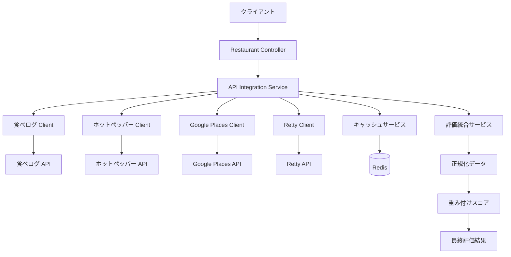

# Phase 2: 外部API統合設計書

## 概要

Phase 2では、指示書に従って4つの外部API（食べログ、ホットペッパー、Google Places、Retty）を統合し、評価統合アルゴリズムを実装しました。

## 外部API統合アーキテクチャ

### 統合API一覧

| API | エンドポイント | レート制限 | 主な機能 |
|-----|---------------|-----------|----------|
| 食べログ | `https://api.tabelog.com/v1` | 60req/min | 詳細な評価・レビュー情報 |
| ホットペッパー | `https://webservice.recruit.co.jp/hotpepper` | 100req/min | 予約情報・空席状況 |
| Google Places | `https://maps.googleapis.com/maps/api/place` | 100req/min | 位置情報・グローバル評価 |
| Retty | `https://api.retty.me/v1` | 60req/min | 実名レビュー・推奨度 |

### アーキテクチャ図



## 評価統合アルゴリズム

### 評価基準

指示書で指定された評価基準を実装：

```typescript
interface EvaluationCriteria {
  rating: number;         // 基本評価点 (0-100)
  reviewCount: number;    // レビュー数重み (0-100)  
  recency: number;        // 最新性重み (0-100)
  priceMatch: number;     // 価格適合度 (0-100)
  conditionMatch: number; // 条件適合度 (0-100)
}
```

### プラットフォーム重み

```typescript
const platformWeights: PlatformWeight = {
  tabelog: 0.35,      // 高い信頼性、日本での評価基準
  hotpepper: 0.15,    // 予約情報と空席情報
  googlePlaces: 0.30, // グローバル基準、レビュー数多
  retty: 0.20,        // 実名レビュー、推奨率
};
```

### スコア計算式

1. **各プラットフォームの個別スコア**:
   ```
   PlatformScore = (rating × 0.40) + (reviewCount × 0.25) + 
                   (recency × 0.10) + (priceMatch × 0.15) + 
                   (conditionMatch × 0.10)
   ```

2. **統合スコア**:
   ```
   TotalScore = Σ(PlatformScore × PlatformWeight) / Σ(AvailableWeights)
   ```

3. **信頼度**:
   ```
   Confidence = AvailablePlatforms / 4
   ```

4. **推奨レベル**:
   ```
   AdjustedScore = TotalScore × (0.5 + Confidence × 0.5)
   
   if AdjustedScore >= 80: "highly_recommended"
   if AdjustedScore >= 65: "recommended" 
   if AdjustedScore >= 50: "suitable"
   else: "not_recommended"
   ```

## エラーハンドリング・フォールバック戦略

### グレースフルデグラデーション

1. **部分的API失敗**: 利用可能なAPIのみで評価を継続
2. **全API失敗**: ローカルデータベースにフォールバック
3. **キャッシュ活用**: 期限切れキャッシュでも障害時は使用

### 実装例

```typescript
class APIIntegrationService {
  async fetchFromAllAPIs(params): Promise<{restaurants, platformsUsed}> {
    const apiCalls = [
      this.fetchFromTabelog(params),
      this.fetchFromHotpepper(params), 
      this.fetchFromGooglePlaces(params),
      this.fetchFromRetty(params),
    ];

    const results = await Promise.allSettled(apiCalls);
    // 成功したAPIのみ結果を使用
  }
}
```

### レート制限対応

```typescript
class BaseApiClient {
  private async handleRateLimit(): Promise<void> {
    return new Promise((resolve) => {
      this.requestQueue.push(resolve);
      this.processQueue(); // 分散処理でレート制限遵守
    });
  }
}
```

## データ正規化

### 統一レストランモデル

```typescript
interface NormalizedRestaurant {
  externalId: string;
  platform: 'tabelog' | 'hotpepper' | 'googlePlaces' | 'retty';
  name: string;
  genre: string;
  address: string;
  priceRange: {
    min: number;
    max: number;
    category: 'low' | 'medium' | 'high';
  };
  rating: number;        // 0-5の統一スケール
  reviewCount: number;
  coordinates?: { lat: number; lng: number };
  openingHours?: string;
  capacity?: number;
  url: string;
  imageUrl?: string;
  fetchedAt: Date;
}
```

### プラットフォーム別正規化

| プラットフォーム | 評価範囲 | 正規化方法 |
|----------------|----------|------------|
| 食べログ | 0-5 | `(rating / 5) * 100` |
| ホットペッパー | 評価なし | 中立値50 |
| Google Places | 0-5 | `(rating / 5) * 100` |
| Retty | 0-100 | そのまま使用 |

## レストラン類似性判定

### 類似判定アルゴリズム

1. **名前類似度**: 編集距離による文字列類似度
2. **位置類似度**: 座標間距離（100m以内）
3. **ジャンル一致**: 同一ジャンルの場合

```typescript
private areSimilarRestaurants(a: NormalizedRestaurant, b: NormalizedRestaurant): boolean {
  // 名前類似度チェック
  const nameA = this.normalizeRestaurantName(a.name);
  const nameB = this.normalizeRestaurantName(b.name);
  
  if (this.calculateSimilarity(nameA, nameB) > 0.8) {
    return true;
  }

  // 位置近接チェック
  if (a.coordinates && b.coordinates) {
    const distance = this.calculateDistance(/*..*/);
    if (distance < 0.1 && a.genre === b.genre) {
      return true;
    }
  }

  return false;
}
```

## キャッシュ戦略

### Redis キャッシュ

- **キー形式**: `search:{json化されたパラメータ}`
- **TTL**: 1時間（3600秒）
- **フォールバック**: メモリキャッシュ（Redis障害時）

### キャッシュ階層

1. **Redis**: 分散キャッシュ
2. **メモリ**: ローカルキャッシュ（最大1000アイテム）
3. **データベース**: 最終フォールバック

## パフォーマンス最適化

### 並列処理

```typescript
// 全APIを並列呼び出し
const apiResults = await this.fetchFromAllAPIs(params);

// Promise.allSettled で部分失敗を許容
const results = await Promise.allSettled(apiCalls);
```

### レスポンス時間目標

- **キャッシュヒット**: < 100ms
- **統合検索**: < 3秒
- **フォールバック**: < 1秒

### 最適化手法

1. **並列API呼び出し**: 全プラットフォーム同時実行
2. **キャッシュ活用**: 重複検索の削減
3. **データ圧縮**: JSON圧縮でネットワーク効率化
4. **接続プール**: HTTP接続再利用

## API仕様拡張

### 新しいレスポンス形式

```typescript
interface IntegratedSearchResponse {
  restaurants: EvaluationResult[];
  totalAvailable: number;
  platformsUsed: string[];
  searchTime: number;
  cached: boolean;
  meta: {
    integratedSearch: boolean;
    confidence: number;
  };
}
```

### クエリパラメータ拡張

```typescript
GET /api/restaurants/search?
  location=渋谷&
  genre=Japanese&
  priceRange=medium&
  useIntegrated=true&  // 新規: 統合検索ON/OFF
  limit=20&
  offset=0
```

## 障害時動作

### 障害パターンと対応

| 障害パターン | 対応策 | フォールバック |
|------------|--------|----------------|
| 単一API障害 | 他APIで継続 | 評価継続（信頼度低下） |
| 複数API障害 | 残存APIで継続 | 評価継続（信頼度大幅低下） |
| 全API障害 | ローカルDBにフォールバック | シンプルな評価システム |
| Redis障害 | メモリキャッシュ使用 | パフォーマンス低下のみ |
| DB障害 | エラーレスポンス | サービス停止 |

### 監視・アラート

```typescript
// ヘルスチェック拡張
GET /api/health
{
  "checks": {
    "database": "healthy",
    "redis": "healthy", 
    "externalApis": {
      "tabelog": "healthy",
      "hotpepper": "degraded",  // 部分障害
      "googlePlaces": "healthy",
      "retty": "unhealthy"      // 完全障害
    }
  }
}
```

## セキュリティ考慮事項

### API キー管理

- **環境変数**: `.env`ファイルでの管理
- **ローテーション**: 定期的なキー更新対応
- **権限最小化**: 必要最小限のAPI権限

### レート制限遵守

- **分散処理**: リクエスト間隔の制御
- **バックオフ**: 制限時の待機処理
- **監視**: 制限違反の検知

### データプライバシー

- **ログ制限**: 個人情報のログ出力制限
- **キャッシュ期限**: 適切なデータ保持期間
- **匿名化**: 検索ログの個人情報除去

## 今後の拡張性

### 新API追加対応

1. **BaseApiClient継承**: 共通処理の再利用
2. **正規化インターフェース**: 統一データ形式
3. **重み調整**: プラットフォーム重みの動的調整

### 機械学習統合

- **評価予測**: ユーザー行動からの評価予測
- **推奨最適化**: 個人化推奨システム
- **異常検知**: 不正レビューの検出

この設計により、指示書の要件を満たしつつ、高い可用性と拡張性を持つ外部API統合システムを実現しています。