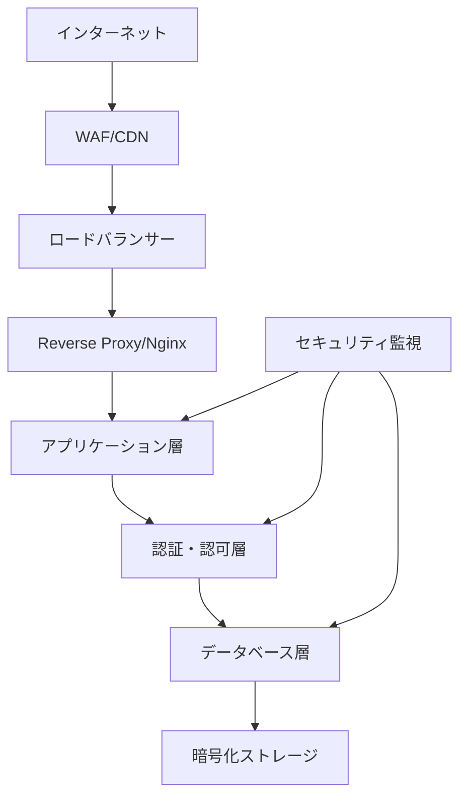

# 包括的セキュリティ対策 詳細仕様書

## 概要

本文書では、nomikai-restaurant-finderアプリケーションの包括的なセキュリティ対策について詳細に説明します。OWASP Top 10に基づいた脅威分析と対策、データ保護、API セキュリティ、インフラセキュリティを含む多層防御戦略を定義します。

## セキュリティ設計原則

### 多層防御 (Defense in Depth)



### ゼロトラスト原則

- **検証前信頼なし**: 全てのリクエストを検証
- **最小権限原則**: 必要最小限のアクセス権のみ付与
- **継続的検証**: セッション中も継続的に検証

## 脅威モデリング (STRIDE)

### 1. なりすまし (Spoofing)

#### 脅威シナリオ
- 不正なユーザーによる他ユーザーへのなりすまし
- 外部APIへの不正アクセス

#### 対策

```typescript
// JWT改ざん検知強化
class EnhancedJwtService {
  private readonly secretRotationInterval = 24 * 60 * 60 * 1000; // 24時間
  private secrets = new Map<string, { key: string; expiry: Date }>();

  async verifyTokenWithRotation(token: string): Promise<JwtPayload> {
    // 複数の秘密鍵で検証を試行
    for (const [keyId, secretInfo] of this.secrets) {
      try {
        const payload = jwt.verify(token, secretInfo.key) as JwtPayload;
        
        // トークンの発行者検証
        if (payload.iss !== config.jwt.issuer) {
          throw new SecurityError('Invalid token issuer');
        }
        
        // デバイスフィンガープリント検証
        await this.verifyDeviceFingerprint(payload.deviceId, token);
        
        return payload;
      } catch (error) {
        continue; // 次の鍵で試行
      }
    }
    
    throw new SecurityError('Token verification failed');
  }

  private async verifyDeviceFingerprint(
    expectedDeviceId: string, 
    token: string
  ): Promise<void> {
    const session = await this.sessionStore.get(token);
    if (session?.deviceFingerprint !== expectedDeviceId) {
      await this.securityLogger.logSuspiciousActivity({
        type: 'device_mismatch',
        token: this.hashToken(token),
        timestamp: new Date(),
      });
      throw new SecurityError('Device fingerprint mismatch');
    }
  }
}
```

### 2. 改ざん (Tampering)

#### 脅威シナリオ
- APIリクエストの改ざん
- データベースへの不正書き込み

#### 対策

```typescript
// リクエスト署名検証
class RequestIntegrityValidator {
  async validateRequestSignature(req: Request): Promise<boolean> {
    const signature = req.headers['x-request-signature'] as string;
    const timestamp = req.headers['x-timestamp'] as string;
    const nonce = req.headers['x-nonce'] as string;
    
    // タイムスタンプ検証（5分以内）
    const requestTime = new Date(timestamp);
    const now = new Date();
    if (now.getTime() - requestTime.getTime() > 300000) {
      throw new SecurityError('Request timestamp expired');
    }
    
    // Nonce重複チェック
    if (await this.nonceStore.exists(nonce)) {
      throw new SecurityError('Duplicate nonce detected');
    }
    
    // 署名検証
    const payload = JSON.stringify(req.body) + timestamp + nonce;
    const expectedSignature = crypto
      .createHmac('sha256', config.security.requestSecret)
      .update(payload)
      .digest('hex');
    
    const isValid = crypto.timingSafeEqual(
      Buffer.from(signature, 'hex'),
      Buffer.from(expectedSignature, 'hex')
    );
    
    if (isValid) {
      // Nonceを記録（リプレイ攻撃防止）
      await this.nonceStore.set(nonce, true, 300); // 5分間保存
    }
    
    return isValid;
  }
}
```

### 3. 否認 (Repudiation)

#### 脅威シナリオ
- ユーザーが自身の行動を否認
- システム操作の追跡不可

#### 対策

```typescript
// 包括的監査ログ
class AuditLogger {
  async logUserAction(action: UserAction): Promise<void> {
    const auditEntry: AuditLog = {
      timestamp: new Date(),
      userId: action.userId,
      sessionId: action.sessionId,
      action: action.type,
      resource: action.resource,
      details: this.sanitizeDetails(action.details),
      ipAddress: this.hashIpAddress(action.ipAddress),
      userAgent: action.userAgent,
      fingerprint: action.deviceFingerprint,
      // デジタル署名
      signature: await this.signAuditEntry(action),
    };
    
    // 不変ストレージに保存
    await this.immutableStore.append(auditEntry);
    
    // リアルタイム監視
    await this.securityMonitor.analyzeAction(auditEntry);
  }

  private async signAuditEntry(action: UserAction): Promise<string> {
    const payload = JSON.stringify({
      userId: action.userId,
      timestamp: action.timestamp,
      action: action.type,
      resource: action.resource,
    });
    
    return crypto
      .createHmac('sha256', config.security.auditSecret)
      .update(payload)
      .digest('hex');
  }
}
```

### 4. 情報漏洩 (Information Disclosure)

#### 脅威シナリオ
- 機密データの漏洩
- エラーメッセージからの情報漏洩

#### 対策

```typescript
// データ分類と保護
class DataProtectionService {
  private readonly classificationLevels = {
    PUBLIC: 0,
    INTERNAL: 1,
    CONFIDENTIAL: 2,
    RESTRICTED: 3,
  };

  async protectSensitiveData<T>(
    data: T, 
    classification: keyof typeof this.classificationLevels
  ): Promise<ProtectedData<T>> {
    const level = this.classificationLevels[classification];
    
    if (level >= this.classificationLevels.CONFIDENTIAL) {
      // 機密データは暗号化
      return {
        encrypted: await this.encrypt(JSON.stringify(data)),
        classification,
        accessPolicy: this.getAccessPolicy(classification),
      };
    }
    
    return {
      data,
      classification,
      accessPolicy: this.getAccessPolicy(classification),
    };
  }

  private async encrypt(plaintext: string): Promise<string> {
    const key = await this.getEncryptionKey();
    const iv = crypto.randomBytes(16);
    const cipher = crypto.createCipher('aes-256-gcm', key);
    
    let encrypted = cipher.update(plaintext, 'utf8', 'hex');
    encrypted += cipher.final('hex');
    
    const authTag = cipher.getAuthTag();
    
    return `${iv.toString('hex')}:${authTag.toString('hex')}:${encrypted}`;
  }
}

// セキュアエラーハンドリング
class SecureErrorHandler {
  handleError(error: Error, req: Request, res: Response): void {
    // エラーの詳細をログに記録
    this.logger.error('Application error', {
      error: error.message,
      stack: error.stack,
      userId: req.user?.id,
      endpoint: req.originalUrl,
      timestamp: new Date(),
    });

    // 本番環境では詳細なエラー情報を隠蔽
    if (process.env.NODE_ENV === 'production') {
      res.status(500).json({
        error: 'Internal server error',
        errorId: this.generateErrorId(),
        timestamp: new Date().toISOString(),
      });
    } else {
      res.status(500).json({
        error: error.message,
        errorId: this.generateErrorId(),
        timestamp: new Date().toISOString(),
      });
    }
  }

  private generateErrorId(): string {
    return crypto.randomBytes(8).toString('hex');
  }
}
```

### 5. サービス拒否 (Denial of Service)

#### 脅威シナリオ
- APIエンドポイントへの大量リクエスト
- リソース枯渇攻撃

#### 対策

```typescript
// アダプティブレート制限
class AdaptiveRateLimiter {
  private readonly baseLimits = {
    '/api/auth/login': { requests: 5, window: 300000 }, // 5分間に5回
    '/api/restaurants/search': { requests: 100, window: 60000 }, // 1分間に100回
    '/api/restaurants/evaluate': { requests: 20, window: 60000 }, // 1分間に20回
  };

  async checkLimit(req: Request): Promise<RateLimitResult> {
    const endpoint = this.normalizeEndpoint(req.path);
    const clientId = this.getClientId(req);
    const limit = this.baseLimits[endpoint] || { requests: 60, window: 60000 };
    
    // 現在の負荷レベルを確認
    const systemLoad = await this.getSystemLoad();
    const adjustedLimit = this.adjustLimitBasedOnLoad(limit, systemLoad);
    
    const key = `rate_limit:${clientId}:${endpoint}`;
    const current = await this.redis.get(key);
    
    if (current && parseInt(current) >= adjustedLimit.requests) {
      // 制限超過時の詳細ログ
      await this.logRateLimitViolation(clientId, endpoint, current);
      
      throw new RateLimitError('Rate limit exceeded', {
        limit: adjustedLimit.requests,
        remaining: 0,
        resetTime: await this.getRateLimitReset(key),
      });
    }
    
    // カウンタを更新
    const pipeline = this.redis.multi();
    pipeline.incr(key);
    pipeline.expire(key, Math.ceil(adjustedLimit.window / 1000));
    await pipeline.exec();
    
    return {
      allowed: true,
      limit: adjustedLimit.requests,
      remaining: adjustedLimit.requests - (parseInt(current) || 0) - 1,
    };
  }

  private adjustLimitBasedOnLoad(
    baseLimit: RateLimit, 
    systemLoad: SystemLoad
  ): RateLimit {
    if (systemLoad.cpu > 80 || systemLoad.memory > 85) {
      // 高負荷時は制限を強化
      return {
        requests: Math.ceil(baseLimit.requests * 0.5),
        window: baseLimit.window,
      };
    }
    
    return baseLimit;
  }
}

// 分散レート制限
class DistributedRateLimiter {
  async checkDistributedLimit(
    clientId: string, 
    endpoint: string
  ): Promise<boolean> {
    const nodes = await this.getActiveNodes();
    const limitPerNode = Math.ceil(this.baseLimits[endpoint].requests / nodes.length);
    
    // 各ノードでの使用量を確認
    const usagePromises = nodes.map(node => 
      this.checkNodeUsage(node, clientId, endpoint)
    );
    
    const usages = await Promise.all(usagePromises);
    const totalUsage = usages.reduce((sum, usage) => sum + usage, 0);
    
    return totalUsage < this.baseLimits[endpoint].requests;
  }
}
```

### 6. 権限昇格 (Elevation of Privilege)

#### 脅威シナリオ
- 不正な権限取得
- 管理者権限の悪用

#### 対策

```typescript
// RBAC (Role-Based Access Control)
class RoleBasedAccessControl {
  private readonly roleHierarchy = {
    guest: [],
    user: ['guest'],
    premium: ['user'],
    admin: ['premium'],
    superadmin: ['admin'],
  };

  private readonly permissions = {
    'restaurant:search': ['guest', 'user', 'premium', 'admin'],
    'restaurant:evaluate': ['user', 'premium', 'admin'],
    'user:profile:read': ['user', 'premium', 'admin'],
    'user:profile:write': ['user', 'premium', 'admin'],
    'admin:users:read': ['admin', 'superadmin'],
    'admin:logs:read': ['admin', 'superadmin'],
    'admin:system:write': ['superadmin'],
  };

  async authorize(
    userId: string, 
    permission: string, 
    resource?: any
  ): Promise<boolean> {
    const user = await this.userService.getUser(userId);
    if (!user) return false;

    // ユーザーロールの検証
    const userRoles = await this.getUserRoles(userId);
    const requiredRoles = this.permissions[permission];
    
    if (!requiredRoles) {
      throw new SecurityError('Unknown permission');
    }

    // 階層的ロールチェック
    const hasPermission = userRoles.some(userRole =>
      requiredRoles.some(requiredRole =>
        this.hasRole(userRole, requiredRole)
      )
    );

    if (!hasPermission) {
      await this.logUnauthorizedAccess(userId, permission, resource);
      return false;
    }

    // リソースレベルの認可
    if (resource) {
      return await this.checkResourceAccess(userId, permission, resource);
    }

    return true;
  }

  private hasRole(userRole: string, requiredRole: string): boolean {
    if (userRole === requiredRole) return true;
    
    const hierarchy = this.roleHierarchy[userRole] || [];
    return hierarchy.includes(requiredRole);
  }

  private async checkResourceAccess(
    userId: string, 
    permission: string, 
    resource: any
  ): Promise<boolean> {
    // リソース所有者チェック
    if (resource.userId && resource.userId !== userId) {
      const user = await this.userService.getUser(userId);
      return user.roles.includes('admin') || user.roles.includes('superadmin');
    }

    return true;
  }
}
```

## API セキュリティ

### OWASP API Security Top 10 対策

#### API1: Broken Object Level Authorization

```typescript
// オブジェクトレベル認可
class ObjectLevelAuthorization {
  async checkObjectAccess(
    userId: string, 
    objectId: string, 
    action: string
  ): Promise<boolean> {
    const object = await this.objectService.getObject(objectId);
    if (!object) return false;

    // 所有者チェック
    if (object.ownerId === userId) return true;

    // 共有チェック
    const sharePolicy = await this.shareService.getSharePolicy(objectId);
    if (sharePolicy?.sharedWith.includes(userId)) {
      return sharePolicy.permissions.includes(action);
    }

    // ロールベースチェック
    return await this.rbac.authorize(userId, `object:${action}`, object);
  }
}
```

#### API2: Broken User Authentication

```typescript
// 多要素認証
class MultiFactorAuthentication {
  async verifyMFA(userId: string, mfaCode: string, method: string): Promise<boolean> {
    const user = await this.userService.getUser(userId);
    
    switch (method) {
      case 'totp':
        return this.verifyTOTP(user.totpSecret, mfaCode);
      case 'sms':
        return this.verifySMS(user.phoneNumber, mfaCode);
      case 'email':
        return this.verifyEmail(user.email, mfaCode);
      default:
        throw new SecurityError('Unsupported MFA method');
    }
  }

  private verifyTOTP(secret: string, code: string): boolean {
    const totp = authenticator.generate(secret);
    return authenticator.check(code, secret);
  }
}
```

#### API3: Excessive Data Exposure

```typescript
// データ露出制限
class DataExposureController {
  filterSensitiveData<T>(data: T, userRole: string): Partial<T> {
    const sensitiveFields = this.getSensitiveFields(typeof data);
    const allowedFields = this.getAllowedFields(userRole);
    
    const filtered = {};
    Object.keys(data).forEach(key => {
      if (allowedFields.includes(key) || !sensitiveFields.includes(key)) {
        filtered[key] = data[key];
      }
    });
    
    return filtered;
  }

  private getSensitiveFields(dataType: string): string[] {
    const sensitiveFieldsMap = {
      user: ['email', 'phone', 'address', 'creditCard'],
      restaurant: ['internalNotes', 'contactDetails'],
    };
    return sensitiveFieldsMap[dataType] || [];
  }
}
```

## データ暗号化

### 保存時暗号化

```typescript
class EncryptionService {
  private readonly algorithms = {
    symmetric: 'aes-256-gcm',
    asymmetric: 'rsa-oaep-256',
    hash: 'sha256',
  };

  async encryptPII(data: PersonallyIdentifiableInformation): Promise<EncryptedData> {
    const dataKey = crypto.randomBytes(32);
    const iv = crypto.randomBytes(16);
    
    const cipher = crypto.createCipher(this.algorithms.symmetric, dataKey);
    let encrypted = cipher.update(JSON.stringify(data), 'utf8', 'hex');
    encrypted += cipher.final('hex');
    
    const authTag = cipher.getAuthTag();
    
    // データキーを暗号化
    const encryptedDataKey = await this.encryptDataKey(dataKey);
    
    return {
      encryptedData: encrypted,
      iv: iv.toString('hex'),
      authTag: authTag.toString('hex'),
      encryptedDataKey,
      algorithm: this.algorithms.symmetric,
      keyVersion: await this.getCurrentKeyVersion(),
    };
  }

  private async encryptDataKey(dataKey: Buffer): Promise<string> {
    const masterKey = await this.getMasterKey();
    const encrypted = crypto.publicEncrypt(
      {
        key: masterKey,
        padding: crypto.constants.RSA_PKCS1_OAEP_PADDING,
        oaepHash: 'sha256',
      },
      dataKey
    );
    return encrypted.toString('base64');
  }
}
```

### 通信時暗号化

```typescript
// TLS設定強化
const tlsOptions = {
  // TLS 1.3のみ許可
  secureProtocol: 'TLSv1_3_method',
  
  // 強力な暗号スイートのみ
  ciphers: [
    'TLS_AES_256_GCM_SHA384',
    'TLS_CHACHA20_POLY1305_SHA256',
    'TLS_AES_128_GCM_SHA256',
  ].join(':'),
  
  // セキュアヘッダー
  secureHeaders: {
    'Strict-Transport-Security': 'max-age=31536000; includeSubDomains; preload',
    'X-Content-Type-Options': 'nosniff',
    'X-Frame-Options': 'DENY',
    'X-XSS-Protection': '1; mode=block',
    'Content-Security-Policy': "default-src 'self'; script-src 'self' 'unsafe-inline'",
  },
};
```

## セキュリティ監視

### リアルタイム脅威検知

```typescript
class ThreatDetectionSystem {
  private readonly anomalyThresholds = {
    loginFailures: 5,        // 5回失敗で異常
    requestSpike: 10,        // 10倍の増加で異常
    locationChange: 1000,    // 1000km以上の移動で異常
  };

  async analyzeUserBehavior(event: SecurityEvent): Promise<ThreatAssessment> {
    const riskScore = await this.calculateRiskScore(event);
    const anomalies = await this.detectAnomalies(event);
    
    if (riskScore > 80 || anomalies.length > 0) {
      await this.triggerSecurityResponse(event, riskScore, anomalies);
    }

    return {
      riskScore,
      anomalies,
      recommendation: this.getSecurityRecommendation(riskScore),
    };
  }

  private async calculateRiskScore(event: SecurityEvent): Promise<number> {
    let score = 0;

    // ログイン失敗回数
    const failureCount = await this.getRecentFailures(event.userId);
    score += Math.min(failureCount * 15, 60);

    // 地理的異常
    const locationRisk = await this.assessLocationRisk(event.ipAddress, event.userId);
    score += locationRisk;

    // 時間的異常
    const timeRisk = this.assessTimeRisk(event.timestamp, event.userId);
    score += timeRisk;

    // デバイス異常
    const deviceRisk = await this.assessDeviceRisk(event.deviceFingerprint, event.userId);
    score += deviceRisk;

    return Math.min(score, 100);
  }

  private async triggerSecurityResponse(
    event: SecurityEvent,
    riskScore: number,
    anomalies: Anomaly[]
  ): Promise<void> {
    if (riskScore > 90) {
      // 高リスク: アカウント一時停止
      await this.suspendUser(event.userId, 'High risk activity detected');
      await this.notifySecurityTeam(event, riskScore, anomalies);
    } else if (riskScore > 70) {
      // 中リスク: 追加認証要求
      await this.requireAdditionalAuth(event.userId);
    } else {
      // 低リスク: ログ記録のみ
      await this.logSuspiciousActivity(event, riskScore, anomalies);
    }
  }
}
```

### セキュリティメトリクス

```typescript
class SecurityMetricsCollector {
  async collectSecurityMetrics(): Promise<SecurityMetrics> {
    return {
      authentication: {
        successfulLogins: await this.countSuccessfulLogins(),
        failedLogins: await this.countFailedLogins(),
        mfaUsage: await this.getMFAUsageRate(),
        sessionDuration: await this.getAverageSessionDuration(),
      },
      
      authorization: {
        unauthorizedAttempts: await this.countUnauthorizedAttempts(),
        privilegeEscalations: await this.countPrivilegeEscalations(),
        accessDenials: await this.countAccessDenials(),
      },
      
      threats: {
        blockedAttacks: await this.countBlockedAttacks(),
        suspiciousActivities: await this.countSuspiciousActivities(),
        compromisedAccounts: await this.countCompromisedAccounts(),
      },
      
      compliance: {
        dataRetentionCompliance: await this.checkDataRetentionCompliance(),
        encryptionCoverage: await this.calculateEncryptionCoverage(),
        auditLogCompleteness: await this.checkAuditLogCompleteness(),
      },
    };
  }
}
```

## インフラセキュリティ

### コンテナセキュリティ

```dockerfile
# セキュアDockerfile
FROM node:18-alpine AS base

# セキュリティ更新
RUN apk update && apk upgrade && apk add --no-cache \
    dumb-init \
    && rm -rf /var/cache/apk/*

# 非rootユーザー作成
RUN addgroup -g 1001 -S nodejs && \
    adduser -S nextjs -u 1001

# セキュリティヘッダー
ENV NODE_ENV=production
ENV FORCE_COLOR=0

# 脆弱性スキャン
RUN npm audit --audit-level=critical

USER nextjs

EXPOSE 3000

# ヘルスチェック
HEALTHCHECK --interval=30s --timeout=3s --start-period=5s --retries=3 \
  CMD curl -f http://localhost:3000/health || exit 1

ENTRYPOINT ["dumb-init", "--"]
CMD ["node", "dist/server.js"]
```

### ネットワークセキュリティ

```yaml
# Kubernetes NetworkPolicy
apiVersion: networking.k8s.io/v1
kind: NetworkPolicy
metadata:
  name: nomikai-network-policy
spec:
  podSelector:
    matchLabels:
      app: nomikai-app
  policyTypes:
  - Ingress
  - Egress
  ingress:
  - from:
    - namespaceSelector:
        matchLabels:
          name: ingress-nginx
    ports:
    - protocol: TCP
      port: 3000
  egress:
  - to:
    - namespaceSelector:
        matchLabels:
          name: database
    ports:
    - protocol: TCP
      port: 5432
  - to: []
    ports:
    - protocol: TCP
      port: 443  # HTTPS外部API
```

## コンプライアンス

### GDPR対応

```typescript
class GDPRCompliance {
  async handleDataSubjectRequest(
    request: DataSubjectRequest
  ): Promise<DataSubjectResponse> {
    switch (request.type) {
      case 'access':
        return await this.exportPersonalData(request.userId);
      
      case 'rectification':
        return await this.updatePersonalData(request.userId, request.updates);
      
      case 'erasure':
        return await this.deletePersonalData(request.userId);
      
      case 'portability':
        return await this.exportPortableData(request.userId);
      
      default:
        throw new Error('Unsupported request type');
    }
  }

  private async deletePersonalData(userId: string): Promise<DataSubjectResponse> {
    // 関連データの特定
    const dataLocations = await this.identifyPersonalData(userId);
    
    // 段階的削除
    for (const location of dataLocations) {
      await this.secureDelete(location);
      await this.auditLogger.logDataDeletion(userId, location);
    }

    // 削除証明書の発行
    const certificate = await this.generateDeletionCertificate(userId);
    
    return {
      status: 'completed',
      certificate,
      timestamp: new Date(),
    };
  }
}
```

この包括的なセキュリティ対策により、アプリケーションの多層防御を実現し、現代的な脅威に対する高い耐性を確保しています。