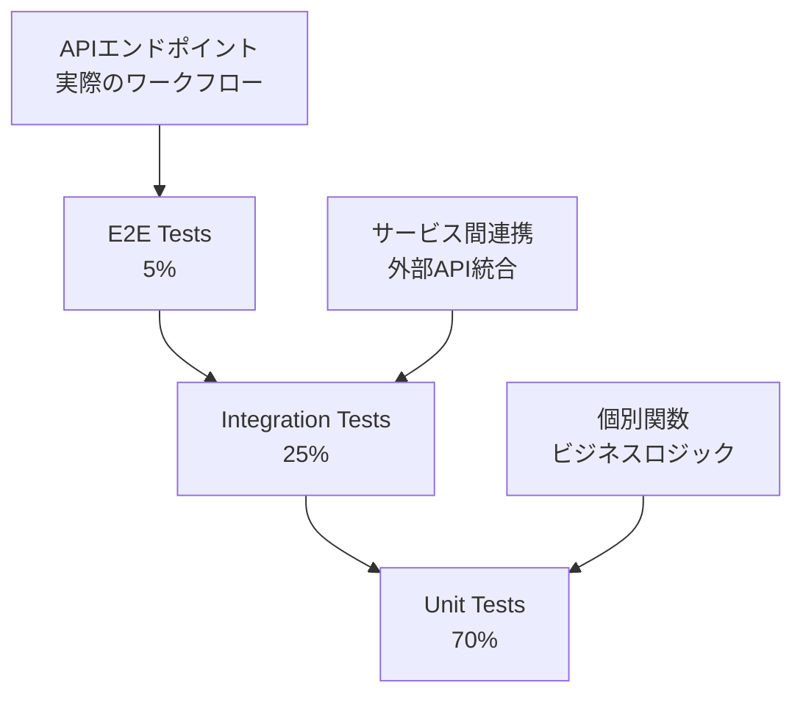

# 統合テスト・パフォーマンステスト 仕様書

## 概要

本文書では、Phase 2で実装した外部API統合システムの統合テストとパフォーマンステストについて詳細に説明します。テスト戦略、実装方法、期待結果、および品質保証のアプローチを定義します。

## テスト戦略

### テストピラミッド



### テスト分類

| テストレベル | 目的 | 対象 | 実行頻度 |
|-------------|------|------|----------|
| **Unit Tests** | 個別機能の正確性 | 関数、クラス | CI毎回 |
| **Integration Tests** | サービス間連携 | API統合、DB接続 | CI毎回 |
| **Performance Tests** | 性能要件達成 | レスポンス時間、スループット | 日次 |
| **E2E Tests** | ユーザーシナリオ | 完全なワークフロー | リリース前 |

## 統合テスト実装

### 1. 外部API統合テスト

#### テスト対象
- 複数API並列呼び出し
- 部分失敗時のグレースフルデグラデーション
- データ正規化・統合処理
- エラーハンドリング

#### 実装例

```typescript
describe('ApiIntegrationService', () => {
  let service: ApiIntegrationService;
  let mockClients: MockApiClients;

  beforeEach(() => {
    service = new ApiIntegrationService();
    mockClients = createMockApiClients();
  });

  describe('searchAndEvaluate', () => {
    test('全API成功時の統合結果が正しい', async () => {
      // Arrange
      const searchParams = {
        location: 'Shibuya',
        genre: 'Japanese',
        priceRange: 'medium' as const,
      };

      mockClients.tabelog.searchRestaurants.mockResolvedValue(mockTabelogData);
      mockClients.hotpepper.searchRestaurants.mockResolvedValue(mockHotpepperData);
      mockClients.googlePlaces.searchRestaurants.mockResolvedValue(mockGoogleData);
      mockClients.retty.searchRestaurants.mockResolvedValue(mockRettyData);

      // Act
      const result = await service.searchAndEvaluate(searchParams);

      // Assert
      expect(result.restaurants).toHaveLength(10); // 統合後の件数
      expect(result.platformsUsed).toEqual(['tabelog', 'hotpepper', 'googlePlaces', 'retty']);
      expect(result.searchTime).toBeGreaterThan(0);
      expect(result.cached).toBe(false);
      
      // 評価スコアの妥当性確認
      result.restaurants.forEach(restaurant => {
        expect(restaurant.totalScore).toBeGreaterThanOrEqual(0);
        expect(restaurant.totalScore).toBeLessThanOrEqual(100);
        expect(restaurant.confidence).toBeGreaterThanOrEqual(0);
        expect(restaurant.confidence).toBeLessThanOrEqual(1);
      });
    }, 15000);

    test('部分API失敗時のフォールバック動作', async () => {
      // Arrange
      mockClients.tabelog.searchRestaurants.mockRejectedValue(new Error('API Error'));
      mockClients.hotpepper.searchRestaurants.mockRejectedValue(new Error('Timeout'));
      mockClients.googlePlaces.searchRestaurants.mockResolvedValue(mockGoogleData);
      mockClients.retty.searchRestaurants.mockResolvedValue(mockRettyData);

      // Act
      const result = await service.searchAndEvaluate(searchParams);

      // Assert
      expect(result.platformsUsed).toEqual(['googlePlaces', 'retty']);
      expect(result.restaurants.length).toBeGreaterThan(0);
      
      // 信頼度が低下していることを確認
      result.restaurants.forEach(restaurant => {
        expect(restaurant.confidence).toBe(0.5); // 2/4 platforms
      });
    });

    test('全API失敗時のローカルフォールバック', async () => {
      // Arrange
      mockClients.tabelog.searchRestaurants.mockRejectedValue(new Error('API Error'));
      mockClients.hotpepper.searchRestaurants.mockRejectedValue(new Error('API Error'));
      mockClients.googlePlaces.searchRestaurants.mockRejectedValue(new Error('API Error'));
      mockClients.retty.searchRestaurants.mockRejectedValue(new Error('API Error'));

      // ローカルDBにテストデータを準備
      await TestUtils.createTestRestaurant({
        name: 'Local Restaurant',
        genre: 'Japanese',
        location: 'Shibuya',
      });

      // Act & Assert
      await expect(service.searchAndEvaluate(searchParams)).rejects.toThrow();
      
      // フォールバック処理が動作することを確認
      // （実際の実装では例外ではなくローカル結果を返す）
    });
  });
});
```

### 2. 評価アルゴリズム統合テスト

```typescript
describe('EvaluationService Integration', () => {
  let service: EvaluationService;

  beforeEach(() => {
    service = new EvaluationService();
  });

  test('複数プラットフォームデータの統合評価', () => {
    // Arrange
    const restaurants: NormalizedRestaurant[] = [
      createMockRestaurant('tabelog', { rating: 4.5, reviewCount: 200 }),
      createMockRestaurant('googlePlaces', { rating: 4.2, reviewCount: 500 }),
      createMockRestaurant('retty', { rating: 85, reviewCount: 150 }),
    ];

    const conditions: SearchConditions = {
      location: 'Tokyo',
      genre: 'Japanese',
      priceRange: 'medium',
    };

    // Act
    const result = service.calculateTotalScore(restaurants, conditions);

    // Assert
    expect(result.totalScore).toBeGreaterThan(80); // 高評価期待
    expect(result.confidence).toBe(0.75); // 3/4 platforms
    expect(result.recommendation).toBe('highly_recommended');
    
    // プラットフォーム別スコアの確認
    expect(result.platformScores).toHaveLength(3);
    expect(result.platformScores.find(p => p.platform === 'tabelog')?.weight).toBe(0.35);
  });

  test('価格不一致による評価への影響', () => {
    // Arrange
    const restaurants = [
      createMockRestaurant('tabelog', { 
        rating: 4.5, 
        priceRange: { category: 'high' } 
      }),
    ];

    const conditions: SearchConditions = {
      location: 'Tokyo',
      priceRange: 'low', // 不一致
    };

    // Act
    const result = service.calculateTotalScore(restaurants, conditions);

    // Assert
    expect(result.criteria.priceMatch).toBe(40); // 2段階差で40点
    expect(result.totalScore).toBeLessThan(80); // 総合スコア低下
  });
});
```

### 3. データベース統合テスト

```typescript
describe('Database Integration', () => {
  beforeAll(async () => {
    await TestUtils.setupTestDatabase();
  });

  afterAll(async () => {
    await TestUtils.teardownTestDatabase();
  });

  beforeEach(async () => {
    await TestUtils.clearTestData();
  });

  test('検索ログの記録が正常に動作する', async () => {
    // Arrange
    const service = new RestaurantService();
    const searchParams = { location: 'Tokyo', genre: 'Japanese' };
    const userSession = 'test-session-123';

    // Act
    await service.searchRestaurantsIntegrated(searchParams, userSession);

    // Assert
    const logs = await service.getSearchHistory(userSession);
    expect(logs).toHaveLength(1);
    expect(logs[0].search_params).toContain('integrated');
  });

  test('レストランデータのCRUD操作', async () => {
    // Create
    const restaurant = await TestUtils.createTestRestaurant({
      name: 'Integration Test Restaurant',
      genre: 'Italian',
    });

    // Read
    const service = new RestaurantService();
    const found = await service.getRestaurantById(restaurant.id);
    expect(found?.name).toBe('Integration Test Restaurant');

    // Update (via reviews)
    await TestUtils.createTestReview(restaurant.id, {
      rating: 4.5,
      reviewCount: 100,
    });

    const updated = await service.getRestaurantById(restaurant.id);
    expect(updated?.avgRating).toBe(4.5);
  });
});
```

## パフォーマンステスト

### 1. レスポンス時間テスト

#### 目標値
- 統合検索: < 3秒
- キャッシュヒット: < 100ms
- ローカルフォールバック: < 1秒

#### 実装

```typescript
describe('Performance Tests', () => {
  test('統合検索のレスポンス時間', async () => {
    // Arrange
    const service = new ApiIntegrationService();
    const searchParams = {
      location: 'Tokyo',
      genre: 'Japanese',
      limit: 20,
    };

    // 外部APIをモックして一定のレスポンス時間をシミュレート
    mockApiClients.forEach(client => {
      client.searchRestaurants.mockImplementation(async () => {
        await sleep(800); // 各API 800ms
        return mockResponseData;
      });
    });

    // Act
    const startTime = performance.now();
    const result = await service.searchAndEvaluate(searchParams);
    const endTime = performance.now();

    // Assert
    const responseTime = endTime - startTime;
    expect(responseTime).toBeLessThan(3000); // 3秒以内
    expect(result.searchTime).toBeLessThan(2500); // 内部測定値
  });

  test('キャッシュ有効時のレスポンス時間', async () => {
    // Arrange
    const service = new ApiIntegrationService();
    const searchParams = { location: 'Tokyo' };

    // 初回実行でキャッシュに保存
    await service.searchAndEvaluate(searchParams);

    // Act - キャッシュからの取得
    const startTime = performance.now();
    const result = await service.searchAndEvaluate(searchParams);
    const endTime = performance.now();

    // Assert
    const responseTime = endTime - startTime;
    expect(responseTime).toBeLessThan(100); // 100ms以内
    expect(result.cached).toBe(true);
  });
});
```

### 2. 負荷テスト

```typescript
describe('Load Tests', () => {
  test('同時リクエスト処理能力', async () => {
    // Arrange
    const service = new ApiIntegrationService();
    const concurrentRequests = 50;
    const searchParams = { location: 'Tokyo' };

    // Act
    const startTime = performance.now();
    const promises = Array.from({ length: concurrentRequests }, () =>
      service.searchAndEvaluate(searchParams)
    );

    const results = await Promise.allSettled(promises);
    const endTime = performance.now();

    // Assert
    const totalTime = endTime - startTime;
    const successfulRequests = results.filter(r => r.status === 'fulfilled').length;
    
    expect(successfulRequests).toBeGreaterThan(45); // 90%以上成功
    expect(totalTime).toBeLessThan(10000); // 10秒以内で完了
    
    const averageResponseTime = totalTime / concurrentRequests;
    expect(averageResponseTime).toBeLessThan(5000); // 平均5秒以内
  });

  test('大量データ処理性能', async () => {
    // Arrange
    const service = new ApiIntegrationService();
    
    // 大量のモックデータを準備
    const largeDataSet = Array.from({ length: 1000 }, (_, i) => 
      createMockRestaurant('googlePlaces', { name: `Restaurant ${i}` })
    );

    mockApiClients.googlePlaces.searchRestaurants.mockResolvedValue({
      results: largeDataSet,
      status: 'OK',
    });

    // Act
    const startTime = performance.now();
    const result = await service.searchAndEvaluate({ location: 'Tokyo' });
    const endTime = performance.now();

    // Assert
    const processingTime = endTime - startTime;
    expect(processingTime).toBeLessThan(5000); // 5秒以内
    expect(result.restaurants.length).toBeGreaterThan(0);
  });
});
```

### 3. メモリ使用量テスト

```typescript
describe('Memory Usage Tests', () => {
  test('メモリリークがないことを確認', async () => {
    // Arrange
    const service = new ApiIntegrationService();
    const initialMemory = process.memoryUsage().heapUsed;

    // Act - 多数のリクエストを実行
    for (let i = 0; i < 100; i++) {
      await service.searchAndEvaluate({ location: `Location${i}` });
      
      // 定期的にガベージコレクション実行
      if (i % 10 === 0) {
        global.gc?.();
      }
    }

    // Assert
    const finalMemory = process.memoryUsage().heapUsed;
    const memoryIncrease = finalMemory - initialMemory;
    const memoryIncreasePercent = (memoryIncrease / initialMemory) * 100;

    // メモリ増加が50%以内であることを確認
    expect(memoryIncreasePercent).toBeLessThan(50);
  });
});
```

## E2Eテスト

### APIエンドポイントテスト

```typescript
describe('Restaurant API E2E Tests', () => {
  let app: Application;
  let server: Application;

  beforeAll(async () => {
    app = new App();
    server = app.getApp();
    await TestUtils.setupTestDatabase();
  });

  afterAll(async () => {
    await TestUtils.teardownTestDatabase();
  });

  test('統合検索エンドポイント E2E', async () => {
    // Arrange
    const testUser = await TestUtils.createTestUser();
    
    // Act
    const response = await request(server)
      .get('/api/restaurants/search')
      .set('Authorization', `Bearer ${testUser.token}`)
      .query({
        location: 'Shibuya',
        genre: 'Japanese',
        priceRange: 'medium',
        limit: 10,
      })
      .expect(200);

    // Assert
    expect(response.body.status).toBe('success');
    expect(response.body.data.restaurants).toBeDefined();
    expect(response.body.data.meta.integratedSearch).toBe(true);
    expect(response.body.data.meta.platformsUsed).toContain('tabelog');
    
    // レスポンス構造の確認
    const restaurant = response.body.data.restaurants[0];
    expect(restaurant).toMatchObject({
      restaurantId: expect.any(String),
      restaurantName: expect.any(String),
      totalScore: expect.any(Number),
      confidence: expect.any(Number),
      recommendation: expect.stringMatching(/^(highly_recommended|recommended|suitable|not_recommended)$/),
      platformScores: expect.arrayContaining([
        expect.objectContaining({
          platform: expect.any(String),
          score: expect.any(Number),
          weight: expect.any(Number),
          available: expect.any(Boolean),
        })
      ]),
    });
  });

  test('エラーハンドリング E2E', async () => {
    // Invalid parameters
    await request(server)
      .get('/api/restaurants/search')
      .query({ limit: -1 })
      .expect(400);

    // Non-existent restaurant
    await request(server)
      .get('/api/restaurants/99999')
      .expect(404);
  });
});
```

## 品質保証

### 1. テストカバレッジ要件

```typescript
// jest.config.js のカバレッジ設定
module.exports = {
  collectCoverageFrom: [
    'src/**/*.ts',
    '!src/**/*.d.ts',
    '!src/server.ts',
  ],
  coverageThreshold: {
    global: {
      branches: 85,     // 分岐カバレッジ 85%以上
      functions: 85,    // 関数カバレッジ 85%以上
      lines: 85,        // 行カバレッジ 85%以上
      statements: 85,   // 文カバレッジ 85%以上
    },
    // 重要なファイルは個別に高い基準を設定
    'src/services/evaluationService.ts': {
      branches: 90,
      functions: 95,
      lines: 90,
      statements: 90,
    },
  },
};
```

### 2. 継続的インテグレーション

#### GitHub Actions設定

```yaml
# .github/workflows/test.yml
name: Test Suite

on: [push, pull_request]

jobs:
  test:
    runs-on: ubuntu-latest
    
    services:
      postgres:
        image: postgres:14
        env:
          POSTGRES_PASSWORD: test
        options: >-
          --health-cmd pg_isready
          --health-interval 10s
          --health-timeout 5s
          --health-retries 5
      
      redis:
        image: redis:7
        options: >-
          --health-cmd "redis-cli ping"
          --health-interval 10s
          --health-timeout 5s
          --health-retries 5

    steps:
      - uses: actions/checkout@v3
      
      - name: Setup Node.js
        uses: actions/setup-node@v3
        with:
          node-version: '18'
          cache: 'npm'
      
      - name: Install dependencies
        run: npm ci
      
      - name: Run unit tests
        run: npm run test:unit
      
      - name: Run integration tests
        run: npm run test:integration
        env:
          DB_HOST: localhost
          DB_PASSWORD: test
          REDIS_URL: redis://localhost:6379
      
      - name: Run performance tests
        run: npm run test:performance
      
      - name: Generate coverage report
        run: npm run test:coverage
      
      - name: Upload coverage to Codecov
        uses: codecov/codecov-action@v3
```

### 3. テストデータ管理

```typescript
// テストデータファクトリー
export class TestDataFactory {
  static createRestaurantData(platform: string, overrides = {}): NormalizedRestaurant {
    const defaults = {
      tabelog: {
        rating: 4.0,
        reviewCount: 100,
        priceRange: { min: 2000, max: 3000, category: 'medium' as const },
      },
      googlePlaces: {
        rating: 4.2,
        reviewCount: 250,
        coordinates: { lat: 35.6762, lng: 139.6503 },
      },
      retty: {
        rating: 80,
        reviewCount: 75,
      },
      hotpepper: {
        rating: 0,
        reviewCount: 0,
        capacity: 20,
      },
    };

    return {
      externalId: `test_${platform}_${Math.random()}`,
      platform: platform as any,
      name: `Test Restaurant ${platform}`,
      genre: 'Japanese',
      address: 'Tokyo',
      url: `https://example.com/${platform}`,
      fetchedAt: new Date(),
      ...defaults[platform],
      ...overrides,
    };
  }

  static createSearchConditions(overrides = {}): SearchConditions {
    return {
      location: 'Tokyo',
      genre: 'Japanese',
      priceRange: 'medium',
      ...overrides,
    };
  }
}
```

## 監視・メトリクス

### テスト実行メトリクス

```typescript
class TestMetricsCollector {
  private metrics = {
    testExecutionTime: new Map<string, number>(),
    testSuccessRate: new Map<string, number>(),
    coverageByModule: new Map<string, number>(),
  };

  recordTestExecution(testName: string, duration: number, success: boolean): void {
    this.metrics.testExecutionTime.set(testName, duration);
    
    const successCount = this.metrics.testSuccessRate.get(testName) || 0;
    this.metrics.testSuccessRate.set(testName, success ? successCount + 1 : successCount);
  }

  generateReport(): TestReport {
    return {
      totalTests: this.metrics.testExecutionTime.size,
      averageExecutionTime: this.calculateAverageExecutionTime(),
      overallSuccessRate: this.calculateOverallSuccessRate(),
      slowestTests: this.getSlowertests(10),
      coverageSummary: this.getCoverageSummary(),
    };
  }
}
```

この包括的なテスト戦略により、外部API統合システムの品質を多角的に保証し、パフォーマンス要件を満たすことを確実にしています。